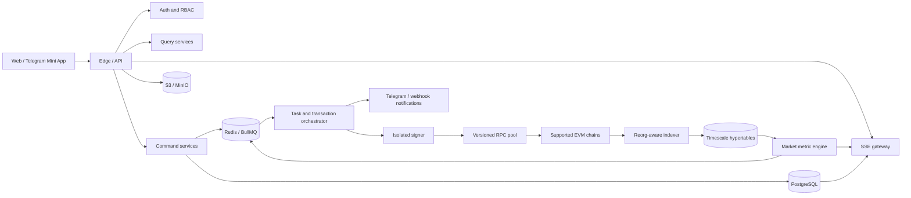
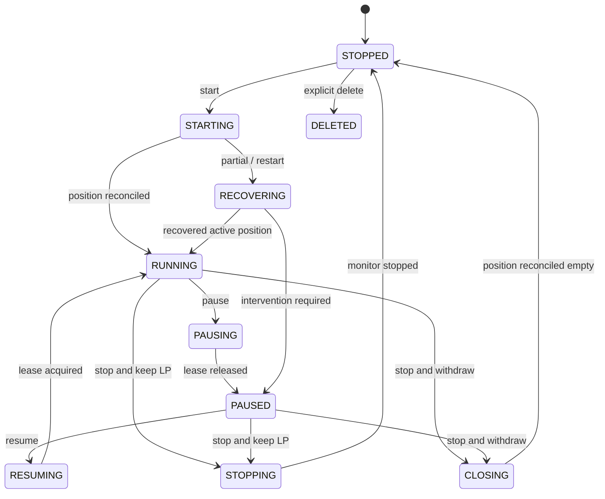
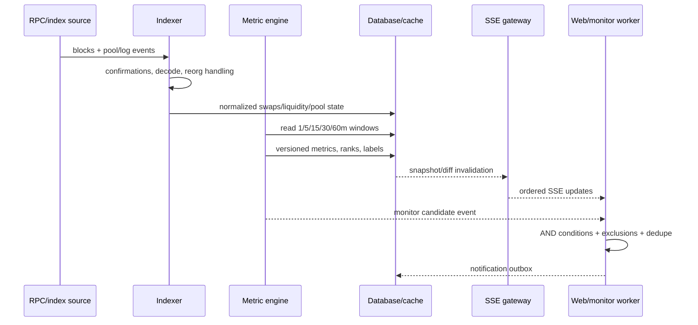

# LPBot 复现目标架构与工作流

> 基线日期：2026-08-13  
> 范围来源：[功能矩阵](./FUNCTION_MATRIX.md)、[公开产品面](./research/public-surface.md)、[链上 Helper](./research/onchain-helper.md)、[历史任务](./research/prior-thread.md)  
> 设计目标：复现当前可观察的外部行为，同时让资金动作可模拟、可幂等、可恢复、可审计。

## 1. 架构结论

采用 TypeScript monorepo，先交付模块化单体 API 和独立 worker/indexer；通过事件、队列和数据库契约划清边界，等负载证明确有需要时再拆微服务。

| 层 | 推荐技术 | 责任 |
|---|---|---|
| Web | React 18、Vite、React Router、Radix/shadcn 风格组件、Lucide、Viem/Wagmi、Lightweight Charts | 1:1 UI、登录、配置、只读数据、SSE、交易确认状态 |
| API | Node.js 22、TypeScript、Fastify、TypeBox/Zod、OpenAPI | 59 个公开端点兼容层、站内 API、鉴权、RBAC、SSE 聚合 |
| Worker | BullMQ、Redis、Viem | 任务调度、规则计算、交易 saga、通知和恢复 |
| Indexer | Node.js、Viem、PostgreSQL/TimescaleDB | 多链区块/日志索引、reorg、池指标、流动性动向、仓位读取 |
| Signer | 独立进程、KMS/Vault、AES-256-GCM、Argon2id | 钱包密文、短时解锁、签名、nonce 串行化 |
| Contracts | Solidity、Foundry、OpenZeppelin、官方 V3/V4 interfaces | 钱包 Helper、协议 adapter、测试 Hook、红包合约 |
| Storage | PostgreSQL 16 + TimescaleDB、Redis、S3/MinIO | 事务数据、时序数据、缓存/锁/队列、聊天媒体和证据 |
| Observability | OpenTelemetry、Prometheus、Grafana、Loki、Sentry | trace、metrics、结构化日志、告警、版本关联 |

内部技术无需逐字模仿目标站，但公开路径、字段、错误、页面、状态转换、链上余额/NFT/receipt 结果必须通过兼容性测试。

## 2. 系统边界



### 2.1 两个数据平面

1. **市场数据面**只读链、计算排行、标签、K 线、Tick 流动性和地址动向。数据陈旧时降级为只读告警，不触发资金动作。
2. **交易执行面**接收明确 command，生成不可变 execution plan，模拟、签名、广播、确认、对账。它只读取版本化、已确认的市场快照。

这两个平面使用不同的 worker 队列、RPC 限额和数据库账号。热门池流量或聊天流量不能耗尽交易确认所需资源。

### 2.2 信任边界

- 浏览器提交的是意图和参数，不提交最终 router target、fee recipient、manager 地址或任意 calldata。
- API 负责鉴权、schema 和业务授权；orchestrator 再次校验任务 owner、钱包、链权限和冷静期。
- signer 只接受带签名版本、过期时间和策略摘要的 execution plan；它从链注册表解析目标合约。
- indexer 的未确认数据不能直接成为自动关仓依据；规则引擎读取带 `observedAt/blockNumber/finality` 的快照。
- Pro/admin 的 UI 门控仅负责体验，服务端对每个 command 独立执行 RBAC/ABAC。

## 3. Monorepo 布局

```text
apps/
  web/                 # 用户端与管理员路由，共用设计系统
  api/                 # HTTP/OpenAPI/SSE、auth、command/query facade
  worker/              # 任务、策略、通知和交易 saga
  indexer/             # 区块、事件、池指标和 reorg
  signer/              # 最小网络面、密钥解锁和签名
  telegram-bot/        # 一次性登录链接和通知入口
contracts/
  src/                 # Helper、adapter、Hook、红包
  test/                # unit/fuzz/invariant/fork tests
packages/
  api-contract/        # 路径、schema、错误码、SSE envelope
  domain/              # task/pool/wallet/strategy 状态机和规则
  chain-registry/      # 链、协议、合约、字节码 hash、生效区块
  chain-adapters/      # Uni/Pancake V3/V4 encode/decode/simulate
  market-metrics/      # window、aTVL、标签和规则版本
  ui/                  # tokens、基础控件、表格、图表、状态组件
  security/            # secret redaction、SSRF policy、crypto envelope
  observability/       # trace/log/metric 约定
  test-fixtures/       # API/SSE/chain/visual golden fixtures
infra/
  docker/              # 本地 Postgres/Redis/MinIO/Anvil
  migrations/          # SQL migration single source of truth
  deploy/              # staging/testnet/prod manifests
artifacts/
  lpbot/               # 每次目标站更新的只读基线
  acceptance/          # 本项目按功能 ID 保存的验收证据
docs/
```

`packages/api-contract` 是前后端唯一契约源；`packages/chain-registry` 是所有链地址和 Helper 版本的唯一来源。生成文件由 CI 生成，助手不手工维护副本。

## 4. 服务与模块责任

### 4.1 Web

- 路由、导航、响应式布局、主题和 PWA 对齐 `SHELL-*`、`SET-01..02`。
- TanStack Query 管理请求缓存；SSE reducer 只接收 schema 验证后的 snapshot/diff。
- 所有有资金后果的按钮使用 server-generated preview：步骤、报价有效期、最大投入、gas、滑点、预计余额和幂等键。
- UI 状态基线至少包含：loading、empty、partial、stale、error、permission denied、locked、submitted、confirming、recovering、succeeded。
- 金额使用整数 base units 和 decimal library，显示层才格式化；禁止用 JavaScript `number` 表示链上数量。

### 4.2 API

- 提供目标站公开 59 endpoint 的兼容 facade，并把站内 endpoint 放在同一版本化 schema 注册表。
- command endpoint 只创建 `operation`，快速返回 operation ID；前端从 SSE/GET 查询进度。
- query endpoint 从 read model 读取，避免在 HTTP 请求内扫描整链。
- 统一错误 envelope：`code`、`message`、`details`、`requestId`、`retryable`；兼容测试再映射目标站已观察格式。
- 对普通会话、开发者 Key、管理员分别限流和审计；资金 command 还按 user/wallet/chain 限流。

### 4.3 Task scheduler

- 每个运行任务只有一个 lease owner；lease 带 fencing token，防止旧 worker 恢复后继续下单。
- 定时检查只投递 `EvaluateTask(taskId, configVersion, marketVersion)`；执行前重读版本，旧消息幂等丢弃。
- 超区间次数、持续时间、连续规则命中、冷却截止时间全部持久化。
- 任务停止/暂停后取消未来评估，但已经广播的交易继续进入确认和对账，不伪装成已取消。

### 4.4 Indexer 与市场指标

- 每条链维护 `head -> safe -> finalized` 游标，保存 block hash/parent hash。
- 原始日志以 `(chainId, txHash, logIndex)` 唯一；规范化事件以版本化 decoder 产生。
- reorg 时标记孤块数据、回滚派生 rollup，再从共同祖先重放。
- 以 1/5/15/30/60 分钟桶聚合 Fees、Volume、TVL、Txs、FDV、aTVL；公式带 `metricVersion`。
- 标签引擎读取固定版本的窗口数据，输出 `label + score + reasons + computedAt`，以便 golden 校准。
- 排名稳定键为 `metric desc, chainId, poolKey`，同分时不会随机换位。

### 4.5 Signer 与钱包

服务端托管模式：

1. 每个钱包生成随机 256-bit DEK，以 AES-256-GCM 加密私钥。
2. DEK 由 KMS/Vault 中的 KEK 包装；数据库只存 ciphertext、nonce、tag、wrapped DEK 和 key version。
3. signer 在内存中短时解包，签名后覆盖敏感 buffer；API/worker 无解密权限。

用户密码模式：

1. 使用随机 salt 和版本化 Argon2id 参数派生 KEK。
2. 密码只发送给 signer 的专用解锁入口，KEK 仅驻锁定内存并按 auto-lock 失效。
3. 数据库只存加密 blob、KDF 参数和校验 envelope；重置流程明确列出会销毁的任务/钱包。

两种模式均禁止私钥回传、日志记录、错误上报或进入队列 payload。生产必须有密钥恢复、轮换、备份和灾难演练；实现前做独立安全评审。

### 4.6 通知、聊天与管理面

- Telegram/webhook 使用 outbox；业务事务提交后异步投递，按 `(eventId, destination)` 去重。
- webhook 解析 DNS 后阻断 loopback、link-local、私网、metadata endpoint；重定向后再次校验，设置大小/超时/重试上限。
- 聊天消息 append-only，删除为 tombstone；媒体经预签名上传、MIME/大小/恶意内容检查后发布。
- 管理 command 记录 actor、before/after、reason、requestId、IP 和时间；秘密字段只记录是否变化。

## 5. 核心数据模型

| 聚合/表 | 关键字段 | 约束 |
|---|---|---|
| `users` | auth identities、tier、status、fee policy | tier 与 status 变更审计 |
| `sessions/login_tokens/nonces` | hash、expiresAt、usedAt | 单次使用、防重放 |
| `wallets` | address、mode、ciphertext metadata、lock status | `(userId,address)` 唯一；秘密分库/分权 |
| `wallet_helpers` | walletId、chainId、address、version、bytecodeHash、deploymentTx、status | `(walletId,chainId,version)` 唯一 |
| `chain_registry_versions` | chain/protocol addresses、code hashes、valid blocks | 已发布版本不可原地改写 |
| `pools` | chainId、protocol、version、poolAddress/poolId、PoolKey | 规范化 pool identity 唯一 |
| `pool_events` | block/tx/log、event type、amounts、ticks | reorg aware、原始整数 |
| `market_snapshots` | window、metricVersion、values、freshness | 可重算、可追溯 |
| `tasks` | configVersion、status、wallet/pool、lease、cooldown | optimistic version；单一 active operation |
| `task_trigger_state` | out-of-range count/since、rule counters | 重启不丢失 |
| `task_segments` | start/end、capital in/out、fees、PnL basis | 只追加修正，不覆盖历史 |
| `strategies` | schemaVersion、rules、budget、wallet rotation | 激活版本不可变 |
| `operations` | type、idempotencyKey、state、planHash、error | user scope 内幂等 |
| `operation_steps` | ordinal、type、txId、input/output、state | 成功 step 不重复执行 |
| `transactions` | chain/wallet/nonce、raw hash、replacement lineage、receipt | `(chainId,wallet,nonce)` 唯一 |
| `positions` | NFT、owner、liquidity、ticks、fees、source block | chain read model，可重建 |
| `ledger_entries` | asset delta、USD valuation、source tx/segment | double-entry/可对账 |
| `monitors/notifications` | conditions version、delivery state | outbox 去重 |
| `chat_*` | rooms、messages、reactions、read cursors、reports | 多租户授权和审计 |
| `audit_log` | actor/action/resource/before/after | append-only、保留策略 |

### 5.1 金额与时间规则

- 链上金额存 `numeric(78,0)` 或 decimal string；同时保存 token decimals snapshot。
- USD 估值保存值、价格来源、价格时间和计算版本，历史不能随最新价格漂移。
- 所有服务存 UTC；UI 按用户时区显示。区块时间和服务收到时间分别保存。
- Pool ID、地址和 tx hash 内部统一 lowercase bytes/hex，显示时再 checksum。

## 6. API、SSE 与事件契约

### 6.1 API 兼容策略

1. 将 `/api/docs.json` 冻结为 `target-v2026-08-13` fixture。
2. 为 59 endpoint 建 consumer-driven contract test，覆盖 method、path、请求字段、响应、401/403/409/422/429/503。
3. 内部 domain command 与目标 DTO 分离；adapter 负责 camelCase/snake_case 和错误映射。
4. Bundle-only endpoint 标 `internal-candidate`，有账号证据后才能升级为 `parity-verified`。

### 6.2 SSE envelope

```json
{
  "stream": "tasks",
  "type": "tasks_diff",
  "version": 1,
  "sequence": 1042,
  "eventId": "tasks:USER:1042",
  "serverTime": "2026-08-13T12:00:00.000Z",
  "payload": {}
}
```

- 首连发 snapshot，之后只发有序 diff；25 秒 heartbeat。
- 客户端保存 `eventId/sequence`，以 `Last-Event-ID` 重连；服务端保留短期 replay buffer，过期则重发 snapshot。
- reducer 按 entity version 拒绝旧 diff；重复 event 幂等。
- schema 不兼容时增加 `version` 和新 event type，不改变旧字段语义。
- tasks、prices、chain data、stats、recommended pools、chat、pricing positions 使用独立 sequence，慢流不会阻塞其他流。

## 7. 状态机、幂等与 nonce

### 7.1 Task 生命周期



`ERROR` 是最近一次操作结果，不替代 task 的业务状态。比如 collect 失败后任务仍可为 `RUNNING`，并通过 operation 和日志呈现失败。

### 7.2 Operation 状态

```text
REQUESTED -> VALIDATING -> PLANNING -> SIMULATING -> READY
READY -> NONCE_RESERVED -> SIGNED -> SUBMITTED -> CONFIRMING
CONFIRMING -> CONFIRMED -> RECONCILING -> SUCCEEDED

VALIDATING/PLANNING/SIMULATING -> REJECTED
SIGNED/SUBMITTED/CONFIRMING -> RETRYING or REPLACED
CONFIRMED/RECONCILING -> RECOVERING -> SUCCEEDED or NEEDS_ACTION
any pre-broadcast state -> CANCELLED
```

- `idempotencyKey` 的作用域为 `(userId, commandType, resourceId)`；相同 key 和相同 request hash 返回原 operation，不同 request hash 返回 409。
- execution plan 一旦进入 `READY` 就不可变，包含 chain registry version、quote hash、deadline、expected deltas、fee policy version 和 step list。
- 每个 step 有独立 dedupe key。恢复时先查链上/receipt，再决定重发；从不依据进程内存猜测。

### 7.3 Nonce 队列

- Redis 只负责排队；PostgreSQL 保存 nonce reservation 和 transaction lineage，是恢复事实源。
- 锁粒度为 `(chainId,walletAddress)`，使用 fencing token；同钱包多任务最终串行广播。
- 分配 nonce 前比较 RPC `pending/latest`、本地未完成交易和已确认表。
- replacement 保留相同 nonce，记录 `replacesTxId/replacedByTxId`；只允许提高 gas，不改变 operation plan。
- nonce gap、dropped、reorg 和多 RPC 视图分歧进入 reconciliation，不盲目重复资金动作。

## 8. 链、协议与 Helper 注册表

注册表条目至少包括：

```ts
type ProtocolDeployment = {
  chainId: number;
  protocol: "uniswap" | "pancakeswap";
  version: "v3" | "v4";
  platformId: 1 | 2 | 4 | 5;
  factory?: Address;
  poolManager?: Address;
  positionManager: Address;
  permit2?: Address;
  wrappedNative: Address;
  allowedRouters: Array<{ target: Address; spender?: Address; codeHash: Hex }>;
  helperVersion: string;
  helperCreationCodeHash: Hex;
  validFromBlock: bigint;
  validToBlock?: bigint;
};
```

启动时验证配置地址 code hash；不一致则将该链交易能力置为 degraded。注册表发布需要双人审批和 fork 回归。

当前证据只支持保守分类：`0x71fa74ed/0x5dfd8e50` 是已观察的 V4 组合路径，`0xfb691fd9/0xadc3f25c` 是 V3 组合路径；函数原名未知。adapter 用 selector + ABI version 命名，不把描述性别名固化成生产事实。

Helper 部署：

1. 查询 `wallet_helpers` 和链上 code/owner。
2. 无可用 Helper 时创建 `DEPLOY_HELPER` operation；同钱包/链/version 唯一。
3. 对 creation bytecode、constructor owner、预计地址和 gas 做 fork/eth_call 模拟。
4. 由 owner 直接部署以匹配当前 BSC 样本；若以后引入 factory，登记为新实现版本。
5. 确认后验证 runtime hash、`owner()`、selector 集和 sweep 行为，再标 `ACTIVE`。

## 9. 业务工作流

### 9.1 热门池、手续费排行与监控



验收重点：与目标输出保存同一时刻的 raw events、计算输入和结果；aTVL/标签算法在未校准前标 `implemented-assumed`，不能以 UI 相似冒充一致。

### 9.2 启动任务与自动添加 LP

1. `CreateTask` 只保存版本化配置，初态 `STOPPED`；校验链权限、池、钱包、区间、滑点、余额和冷池策略。
2. `StartTask` 创建 operation 并锁定 task + wallet；重读池和 token metadata。
3. 确保匹配版本的 Helper 已部署并验证 owner/code hash。
4. 计算 tick、双边目标和投入上限；获取有期限的 swap quote。
5. 构造 `approve -> Helper swap+mint` plan，模拟余额、NFT recipient、min amounts、fee 和 dust。
6. 串行签名/广播；等待链确认，解析 NFT id、liquidity、实际 token delta、fee 和 refund。
7. 写 position、ledger 和首个 segment；只有对账完成才把 task 置 `RUNNING`。
8. 任一步失败保留已确认事实：Helper 已部署不重部署，approve 已成功不重复扩大，mint 已成功则转 reconciliation。

### 9.3 复投

1. 冻结 `reinvest-info` 快照并在执行时重读 NFT owner、liquidity、tokens owed、钱包余额。
2. 按 all/token0/token1/both/custom/usd 计算资金来源，分别记录 `fees` 与 `new capital`，避免 PnL 污染。
3. 如需 collect，先完成并对账；生成目标比例 swap 和 Increase plan。
4. Helper 执行 V3/V4 increase 路径，校验 NFT approval、min amounts、fee recipient 和 refund。
5. receipt 对账后写 ledger/segment；collect 成功而 increase 失败时 operation 进入 `RECOVERING_AFTER_COLLECT`，重试只执行剩余步骤。

### 9.4 超区间移仓

1. evaluator 从已确认 tick 快照计算 in/out range，更新持久化 count/since/deviation/rule confirmation。
2. 同时满足配置的次数/持续/偏差且冷却结束时，以 trigger version 创建唯一 operation。
3. 加 task/wallet fencing lock，重读仓位；若价格已回区间则以 `STALE_TRIGGER` 正常结束。
4. 执行 decrease + collect，并对账资产；旧 segment 关闭。
5. 按最新 tick 计算新区间，重新报价/模拟，必要时 swap，再 mint 新 position。
6. 对账 NFT 和资金，创建新 segment，写 cooldown，任务回 `RUNNING`。
7. 撤旧成功而建新失败时进入 `RECOVERING_UNALLOCATED`；按配置留币或卖出，绝不再次撤旧仓。

### 9.5 停止、撤池与撤出后 Swap

- **停止并保留 LP**：释放 scheduler lease，task 置 `STOPPED`，不创建链上交易。
- **停止并撤出**：decrease 100% -> collect -> 可选 burn -> reconcile；空仓视为幂等成功。
- **撤出后单币**：在撤出确认后分别对 token0/token1 报价和 swap；历史样本支持这是多笔 saga，不能假定旧 Helper 单笔原子完成。
- collect 成功、swap 失败时保留双币和恢复按钮；最终余额、gas、fee、dust 和 task segment 分别入账。

### 9.6 换池

1. 验证目标池/平台/链、配置继承字段和钱包余额，创建不可变 migration plan。
2. 暂停旧任务并关闭旧 position，保留 `oldTaskId`。
3. 按目标池 token 组成计算需要的 swap；逐笔确认和对账。
4. 创建 `newTaskId`，确保 Helper，模拟并 mint 新 position。
5. 新任务运行后旧任务停止并写 migration link；任一步失败时 UI 显示资产当前位置和明确继续动作。

### 9.7 创建池和初始流动性

1. 规范化 token 顺序、fee/tickSpacing、价格方向和 decimals；读取 factory/pool manager 确认池不存在。
2. 自动价格来自带 freshness 的市场报价；手动价格转 `sqrtPriceX96` 后做边界和反向显示校验。
3. Step A 调用 V3 factory create+initialize 或 V4 manager initialize，确认 PoolCreated/Initialize 和 pool identity。
4. Step B 调用 quick-liquidity：确保 Helper、计算区间和投入、必要 swap、mint、refund。
5. A 成功 B 失败时状态为 `POOL_CREATED_LIQUIDITY_PENDING`，重试不得重复初始化。
6. `CREATE-05` 不创建长期 task；只写建池/仓位历史并可导入观察列表。

### 9.8 自动策略

- 激活时固定 `strategyVersion`；后续编辑生成新版本，已创建 operation 保留旧版本。
- 候选池来自已确认 market snapshot，依次应用 chain gate、屏蔽表、Hook 策略、条件 DSL、标签、预算、冷却和并发。
- 预算/并发使用数据库原子 reservation；任务成功或确定失败后结算，worker 崩溃由 lease 回收。
- 多钱包选择只选择候选钱包，最终仍进入该钱包的 nonce 队列。
- 关仓 DSL 只产生标准 task operation，不另写一套交易逻辑。

## 10. 安全与风险门禁

| 风险 | 工程控制 |
|---|---|
| 密钥泄露 | 独立 signer、envelope encryption、secret redaction、最小 IAM、备份演练 |
| 任意 calldata/router | 版本化 allowlist、code hash、selector/token/minOut/deadline 校验、plan hash |
| 重放/重复交易 | command idempotency、step dedupe、nonce ledger、receipt-first recovery |
| 滑点/报价过期 | quote expiry、simulation block、max price impact、广播前再检查 |
| RPC 错误/分叉 | 多 provider quorum、safe/finalized、reorg reconciliation |
| 恶意 token/Hook | fork simulation、sellability check、reentrancy/fuzz、Hook 默认排除 |
| 越权 | RBAC + resource ownership + chain/tier ABAC；服务端逐 command 校验 |
| Webhook SSRF | DNS/IP policy、redirect recheck、egress proxy、timeout/size/rate limit |
| 管理误操作 | preview、双确认、审计、staging 演练、可回滚版本 |

资金环境门禁沿用 `R0-R4`。本地 fork 和测试网使用专用钱包；任何主网交易逐笔列出链、钱包、动作、token、最大 USD、最大 gas、预期结果和失败退出方案，再等待明确批准。

## 11. 测试与验收环境

1. **Mock**：API/SSE/UI 状态、规则 DSL、错误和权限矩阵。
2. **Foundry unit/fuzz/invariant**：Helper owner、reentrancy、fee、refund、allowance、NFT recipient。
3. **Anvil 主网 fork**：真实 manager/router/token，重放目标交易 fixture，做 byte-for-byte calldata 和事件 golden。
4. **官方测试网**：BSC Testnet、Base Sepolia、Sepolia；缺少等价部署的协议用自建 fixture 合约。
5. **Staging E2E**：Postgres/Redis/worker 重启、RPC 延迟、nonce 冲突、dropped/replaced/reorg、SSE 断线。
6. **主网只读对照**：页面、API、Bundle、链状态；R4 写入仅逐笔批准。

每个链上 fixture 保存 raw tx、receipt、decoded logs、trace、前后余额、allowance、NFT owner/position、operation steps、task/segment/ledger 状态。

## 12. 部署与可观测性

- 首期按 `web/api/worker/indexer/signer` 独立容器部署；数据库和 Redis 使用托管高可用实例。
- signer 使用单独节点、网络策略和 IAM；只接受 worker mTLS，禁止公网入口。
- 每个 operation 贯穿 `requestId -> operationId -> jobId -> txId/txHash` trace。
- 核心 SLO：SSE freshness、indexer lag、task evaluation lag、queue depth、RPC error、tx pending age、reconciliation backlog、notification delivery。
- 资金告警：未知 code hash、nonce gap、重复 plan、余额差异、Helper dust 超限、NFT owner 不符、fee recipient 不符立即停止该链新交易。
- migration 使用 expand/contract；旧 worker 能读新 schema，新 worker 发布稳定后再删除旧字段。

## 13. 目标站更新窗口

每次目标站发布执行：

1. 保存 HTML、全部入口/懒加载 Chunk、CSS、manifest、API docs 和哈希。
2. 生成 routes/API calls/feature gates/chains 的机器 diff。
3. P0 变化（合约、calldata、费率、地址、签名）立即关闭相关链新建/自动动作。
4. P1 变化（状态机/API/权限）先更新功能矩阵和契约测试。
5. P2 变化（UI/字段/文案）更新截图和视觉回归。
6. 旧兼容版本保留一个发布窗口，完成 staging/fork 验收后切换。

## 14. 当前未知项的处理

| 未知项 | 架构隔离方式 | 闭环证据 |
|---|---|---|
| 排行/aTVL/标签精确公式 | `metricVersion` calculator | 同时刻 raw events + 目标输出 golden |
| 四个 Helper ABI 的完整语义 | selector/ABI version adapter | 每类至少 10 个 calldata 字节回归 |
| Helper 新版 93 bytes | code-hash gated version | runtime diff、trace、fork |
| Pro/admin 实际行为 | feature flag + server policy | 对应角色只读证据/staging 写测 |
| 收费 Hook/红包合约 | 独立 contract package/registry | 源码、测试网部署、owner 操作 fixture |
| 退出/移仓各版本是否原子 | operation step adapter | 成功/失败 tx 样本和 receipt 序列 |
| 收费钱包归因 | fee ledger 独立配置 | token transfer 全历史聚类 |

未知能力可以开发为 `implemented-assumed`，但只有取得相应 `UI/API/CHAIN` 证据并通过兼容测试后才能标记 `parity-verified`。
