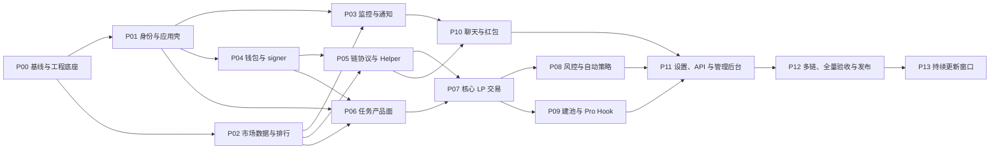

# LPBot 复现开发路线图

> 基线日期：2026-08-13  
> 完整范围：[功能矩阵](./FUNCTION_MATRIX.md)  
> 技术设计：[目标架构与工作流](./ARCHITECTURE_AND_WORKFLOWS.md)  
> 执行方法：[Vibe Coding 手册](./VIBE_CODING_PLAYBOOK.md)  
> 逐项追踪：[功能追踪矩阵](./TRACEABILITY_MATRIX.md)

## 1. 路线图原则

1. 每期交付一个可运行纵向切片：页面、API、数据、权限、测试和证据一起完成。
2. 功能以 `FUNCTION_MATRIX.md` 的 196 个稳定 ID 为范围源；代码、PR、测试和截图都引用 ID。
3. 当前证据不足的能力可达到 `implemented-assumed`，取得相应角色/链上证据后才可达到 `parity-verified`。
4. 市场读取和资金执行分离。只读模块可以先上线；自动资金模块必须依次通过 mock、fork、测试网和 staging 故障注入。
5. 资金工作流按可恢复 saga 实现。数据库状态、链上 receipt 和余额/NFT 对账同时成立才算成功。
6. 每次目标站变化先更新证据、功能矩阵和契约，再更新实现，保留一个兼容发布窗口。

### 1.1 状态词汇

| 状态 | 定义 |
|---|---|
| `discovered` | 发现 UI/API/Bundle/Chain 证据，尚未形成可执行规格 |
| `spec-ready` | 字段、状态、权限、测试和验收样本已明确 |
| `implemented-assumed` | 已按现有证据实现，但缺 Pro/admin/算法/链上对照 |
| `parity-verified` | 目标站可观察行为、契约和相应链上结果均已对照通过 |
| `released` | staging 门禁、迁移、监控和回滚演练通过 |

状态不能跳级。UI 看起来相同不等于 `parity-verified`。

## 2. 推荐团队和并行轨道

| 轨道 | 最小责任 |
|---|---|
| 产品取证/QA | 目标站浏览、网络契约、截图、功能矩阵、验收报告 |
| Web | 设计系统、路由、状态、表格/图表、Playwright |
| API/domain | auth、59 endpoint、任务/策略状态机、账本 |
| Data/indexer | 多链日志、reorg、市场窗口、SSE、排行和标签 |
| Chain/security | signer、Helper/adapters、Foundry、fork/testnet、安全评审 |
| Platform | Postgres/Redis/MinIO、CI/CD、observability、故障演练 |

建议 5-7 人核心团队；一人可兼任相邻轨道，但 signer/合约和验收应有独立复核者。Vibe Coding 助手用于受约束的实现、测试、取证整理和审查，不替代密钥/合约安全评审。

并行关系：



## 3. 阶段总表

| 阶段 | 主范围 | 功能 ID | 风险上限 | 相对规模 |
|---|---|---|---|---|
| P00 | 证据、契约、monorepo、CI、环境 | 横跨全部 ID | R0 | M |
| P01 | 登录、权限、应用壳、基础设置 | `AUTH-*`, `SHELL-*`, `SET-01..02` | R2 | L |
| P02 | Indexer、热门池、K 线、流动性动向、统计 SSE | `POOL-*`, `FLOW-*`, `STATS-*` | R1 | XL |
| P03 | 池监控、Telegram/Webhook 通知 | `MON-*`, `NOTIFY-*` | R2 | L |
| P04 | 钱包、密钥、转账、客户端 RPC/OKX Key | `WALLET-*`, `SET-06..07` | R3 | XL |
| P05 | Swap、仓位、Helper、链适配器 | `SWAP-*`, `POS-*`, `HELPER-*` | R3 | XL |
| P06 | 任务列表/详情/配置/模板 | `TASK-*`, `TCFG-*`, `SET-03` | R3 | XL |
| P07 | 启停、建仓、撤出、收 Fee、移仓、复投、换池 | `TOP-01..08`, `TOP-10..13` | R3/R4 | XXL |
| P08 | 超区间、关仓风控、自动策略、自动补仓 | `TOP-09`, `RISK-*`, `STRAT-*`, `SET-04..05` | R3/R4 | XXL |
| P09 | 创建池、快速初始 LP、私有池、收费 Hook | `CREATE-*` | R3/R4 | XL |
| P10 | 聊天、媒体、徽章、举报、红包 | `CHAT-*` | R4 | XL |
| P11 | 日志、反馈、开发者 API、管理后台 | `LOG-*`, `FEED-*`, `DEV-*`, `ADMIN-*` | R4 | XL |
| P12 | 五链兼容、视觉/契约/链上/恢复全量验收 | 全部 196 ID | R4 | XXL |
| P13 | 目标站更新监测和兼容发布 | 全部 196 ID | 按变更 | 持续 |

相对规模用于排队，不是日历承诺。`XXL` 应继续拆成两周内可评审的子任务，但不能拆散最终纵向验收。

## 4. 分阶段计划

### P00：范围冻结与工程底座

**依赖：** 无。

**工作：**

- 将当前 HTML/Bundle/Chunk/CSS/API docs/链上样本保存为带哈希的只读 artifact。
- 初始化 pnpm/Turborepo monorepo、TypeScript strict、ESLint/Prettier、Changesets。
- 启动本地 Postgres/Timescale、Redis、MinIO、Anvil；建立 migration 和 seed fixture。
- 建 `api-contract`、`domain`、`chain-registry`、`test-fixtures` 包。
- CI 执行 lint、typecheck、unit、contract、Playwright、Foundry、migration、secret scan、依赖审计。
- 建立 `feature_id -> code/test/evidence/status` 检查器，PR 缺功能 ID 或证据时失败。

**测试：** 空仓库 smoke、可重复数据库迁移、seed snapshot、CI 本地/远程一致、Anvil fork 启动。

**完成定义：** 新机器只用版本库和 secret 模板即可运行全栈；目标基线可复核；196 个 ID 都已进入追踪矩阵。

**交付物：** monorepo、Compose、CI、artifact manifest、ADR、覆盖检查器。

### P01：身份、权限与应用壳

**依赖：** P00。

**功能：** `AUTH-01..10`, `SHELL-01..06`, `SET-01..02`。

**当前状态：** 阶段实现完成，P01-08 验收结论为 `accepted-with-gaps`。18 个功能均保持 `implemented-assumed`；真实 Telegram、完整目标角色/状态对照等证据缺口尚在，因此本阶段不标 `parity-verified` 或 `released`。

**工作：**

- 实现 Telegram Mini App、Bot 一次性链接、钱包签名三种登录和会话恢复。
- 实现 pending/rejected/banned/maintenance/region-blocked 状态及 user/pro/admin RBAC。
- 复现桌面侧栏、移动导航、底部状态栏、主题/强调色、导航排序隐藏、PWA。
- 建页面状态目录，逐路由保存 desktop/mobile、light/dark 和 loading/empty/error fixture。

**测试：** nonce/token 重放、过期、跨用户越权、401/403/503 跳转、角色矩阵、axe、键盘导航、Playwright 视觉回归。

**完成定义：** 普通登录账户所有无资金路由可进入；服务端拒绝越权请求；目标视口像素差异有批准阈值和人工报告。

**门禁：** 风险上限 R2。认证和偏好仅允许本地测试账号 R1 写入；AUTH-10 管理写按 R2 进行权限、安全和审计复核；不触发目标站运营写接口。

### P02：市场数据、热门池和流动性动向

**依赖：** P00；可与 P01 并行。

**功能：** `POOL-01..16`, `FLOW-01..05`, `STATS-01..02`。

**当前状态：** 阶段功能实现收官，23 项均为 `implemented-assumed`、0 项为 `planned`；P02 保持 `accepted-with-gaps`。既有公式、目标/live parity、finality 等证据缺口继续 unresolved；任务业务域尚未接入 STATS-01，权威投影未 ready 时返回 503，不伪造零任务。

**工作：**

- 为 BSC 先建 reorg-aware indexer、池注册表、V3/V4 decoder 和回填游标。
- 计算 1/5/15/30/60 分钟 Fees/Volume/TVL/Txs/FDV/aTVL、稳定排名和标签 reasons。
- 实现 `m.lpbot.cc` 兼容 SSE：snapshot/diff、sequence、heartbeat、replay/reconnect。
- 复现排行表、筛选/排序/分组/列偏好/对比、K 线、Tick 流动性和右键操作。
- 复现加池/撤池/新池流、统计、地址聚合、备注和去重回填。

**测试：** decoder fixture、reorg 回滚、窗口边界、重复日志、排序稳定、SSE 丢包/重连、长列表性能、目标输出 golden。

**完成定义：** BSC 相同时间窗和筛选下结构/排序可对照；原始事件到 UI 行可追溯；算法未知项明确显示版本和验收状态。

**门禁：** 只读 RPC；aTVL/标签在精确公式未校准前为 `implemented-assumed`。

### P03：池监控和外部通知

**依赖：** P01、P02。

**功能：** `MON-01..06`, `NOTIFY-01..02`。

**当前状态：** P03 功能实现收官，8 项均为 `implemented-assumed`、0 项为 `planned`，阶段保持 `accepted-with-gaps`。P03-04 已完成独立 Dispatcher、安全 Webhook/Telegram 适配器、原子通知历史投影、当前用户历史 API 与 desktop/mobile UI；所有投递验收均为注入式本地 fixture。active TVL、Fee/aTVL、目标 UI parity、live Telegram/Webhook delivery、delivery SLO 以及生产 retention 策略继续 unresolved，不标记 `parity-verified` 或 `released`。

**工作：** 监控 CRUD/启停、多条件 AND、中文/Hook 排除、通知历史、分类 Telegram 通知和 GET/POST Webhook 模板。

**测试：** 条件真值表、窗口 freshness、重复候选去重、outbox 恢复、签名 webhook、DNS rebinding/重定向/私网 SSRF、超时/重试/限流。

**完成定义：** 固定市场 fixture 产生唯一预期通知；目标 UI/字段通过契约和视觉对照；投递失败不阻塞市场 worker。

**门禁：** webhook 测试只到本地 sink/staging 域名；生产外部目标需明确登记。

### P04：钱包、密钥和签名服务

**依赖：** P00、P01。

**功能：** `WALLET-01..10`, `SET-06..07`。

**工作：**

- 隔离 signer；实现生成/导入、envelope encryption、用户密码 Argon2id、自动锁和重置预览。
- 实现钱包列表、余额/估值/token 导入、地址簿/二维码、安全密码、原生/ERC-20 转账。
- 实现本机只读 RPC 和用户 OKX Key 管理；所有 secret 不回显、不进日志/队列。
- 建 per-wallet/per-chain nonce ledger、replacement lineage 和签名审计。

**测试：** crypto known-answer、密文篡改、锁定/重启、权限隔离、日志泄密扫描、并发 nonce、dropped/replaced、转账幂等、余额/gas 边界。

**完成定义：** 密钥生命周期和灾难恢复演练通过；API/worker 无解密权限；fork 转账前后余额和 nonce 精确对账。

**门禁：** 独立安全评审后才进测试网；测试钱包与研究/生产钱包隔离。

**当前状态：** P04-04 在 P04-02 隔离 signer 与 P04-03 Keystore 生命周期上完成钱包命名、删除预览、普通/强制删除、Envelope 不可恢复清除，以及与 Keystore 完全分域的安全密码生命周期和 signer 内部验证端口。P04 当前为 7 项 `implemented-assumed`、5 项 `planned`，继续 `accepted-with-gaps`。验收仅使用合成密码/钱包和本地 KMS/PostgreSQL/browser/依赖 fixture；生产任务、策略、仓位、资产 inventory 与任务协调器适配未接入时删除 fail closed。签名、raw transaction、广播和外部 RPC 调用均为 0，独立安全评审和生产 custody 运维仍未完成，不标记 `parity-verified`、`released` 或 custody-ready。

### P05：链适配器、Swap、仓位和 Helper

**依赖：** P02、P04。

**功能：** `SWAP-01..02`, `POS-01..04`, `HELPER-01..06`。

**工作：**

- 建链/协议/合约/code-hash 注册表和 Uni/Pancake V3/V4 adapters。
- 用历史 `ObservedHelperCodec` 回归四个 selector；实现 owner-only Helper 兼容版本和 sweep。
- 实现 Helper 部署/登记/版本/残留扫描，Swap quote/execute，仓位扫描/collect/decrease。
- 每个平台覆盖普通 approval、Permit2、单边/双边、native wrap/unwrap、fee/refund。

**测试：** Foundry unit/fuzz/invariant、恶意 router/token/reentrancy、ABI 字节回归、Anvil fork、非 owner、code hash 不符、dust/allowance/NFT owner 断言。

**完成定义：** 四类入口每类至少 10 个生产 calldata fixture 字节级回归；fork 中 mint/increase/collect/decrease/swap/sweep 均有成功和失败样本。

**门禁：** P04 安全门通过；合约独立审查；测试网部署前冻结 ABI/registry version。

### P06：任务产品面和配置

**依赖：** P01、P02、P04；链动作由 P05 mock 到真实 adapter。

**功能：** `TASK-01..13`, `TCFG-01..17`, `SET-03`。

**工作：**

- 复现 running/paused/stopped、网格/列表、搜索/筛选/折叠、多选和任务详情。
- 实现资产/仓位/Fee/PnL/segment、K 线标记、日志、分享图、分析抽屉、观察列表和地址扫描。
- 实现创建/编辑向导、V3 address/V4 Pool ID、区间/tick、单边、fixed/all-in、滑点/间隔/阈值/冷却、模板和收费报价。
- 配置和前端 DTO 全部 schema/version 化；实现运行中编辑的暂停/恢复 mock 状态机。

**测试：** 字段默认值/边界/联动、tick 数学 property tests、金额精度、API contracts、SSE reducer、PnL ledger golden、所有 UI 状态视觉回归。

**完成定义：** 普通用户只读和配置体验对照完成；提交前 preview 与目标字段一致；尚未连接链上执行的操作明确使用 mock operation。

**门禁：** `fixed/all-in` 到 P07 前仅模拟，不广播。

### P07：核心 LP 交易工作流

**依赖：** P05、P06。

**功能：** `TOP-01..08`, `TOP-10..13`。

**工作：**

- 建通用 operation/step/transaction saga 和 task 生命周期。
- 实现首次 Helper、启动/自动添加 LP、暂停/恢复、停止保留、停止撤出和撤出后单币。
- 实现 collect、collect 后 swap、手动移仓、复投、换池、复制和删除。
- 对每个部分成功点提供恢复动作；receipt 对账后更新 position、segment、ledger 和日志。

**测试：** 每一 step revert、worker/API/DB/Redis 重启、RPC 超时、nonce gap/replacement、reorg、重复 command、余额差异、空仓幂等、SSE 进度。

**完成定义：** 六类工作流在 fork 与测试网各有成功/失败 fixture；任意进程终止后可从数据库+链恢复，不重复资金动作。

**门禁：** 先 Anvil fork，再测试网 R3。主网 R4 每笔另行批准，绝不把 10-20 USD 示例视为持续授权。

### P08：风控、自动移仓和自动策略

**依赖：** P02、P07。

**功能：** `TOP-09`, `RISK-01..15`, `STRAT-01..14`, `SET-04..05`。

**工作：**

- 持久化超区间 count/since/deviation/cooldown；实现自动移仓、失败卖出/留币。
- 实现止盈止损、TVL/Volume/Fee 指标、PnL、时长、IL、组合规则、连续确认、mempool 地址监听和锁定 gas。
- 实现策略 CRUD/导入导出/版本、开关仓 DSL、标签、Hook、币安状态、钱包轮转、预算/并发/冷却和历史。
- 实现自动补仓链/重试参数；策略最终只调用 P07 标准 operation。

**测试：** DSL 真值/property tests、陈旧数据、重启计数、重复事件、并发预算、fencing、价格回区间、mempool 不可用、10 组 x 8 规则边界、chaos E2E。

**完成定义：** 固定市场事件回放产生确定且唯一的开/关仓操作；预算永不超限；失败时资产位置可见且可恢复。

**门禁：** 自动广播默认 feature flag 关闭；完成长时间 shadow mode 后才在测试网开启。主网逐策略、逐钱包审批并设硬上限/kill switch。

### P09：建池、初始流动性和 Pro Hook

**依赖：** P05、P07。

**功能：** `CREATE-01..11`。

**工作：**

- 实现 Uni/Pancake V3/V4 create/initialize、自动/手动初始价、历史和两阶段 saga。
- 实现一次性快速初始流动性，不创建长期任务。
- 按 Bundle 候选实现 BSC UniV4 私有白名单池、收费 Hook 创建/读取/修改/列表。
- Hook owner、fee recipient、bps、动态 LP fee 和 allowlist 由服务端/链上双重校验。

**测试：** token 顺序/decimals/sqrtPrice/tickSpacing 极值、池已存在、A 成功 B 失败恢复、Hook 非 owner、费率边界、allowlist、Foundry fuzz/fork/testnet。

**完成定义：** 普通建池和 quick LP 取得链上 fixture；Pro 能力在缺少账号/生产合约证据时标 `implemented-assumed`，不得标 1:1 已验证。

**门禁：** Hook 合约单独审计；主网 create/initialize/LP 均逐笔批准。

### P10：聊天室、媒体、审核和红包

**依赖：** P01、P03；红包依赖 P04/P05。

**功能：** `CHAT-01..13`。

**工作：** 房间、历史/SSE、回复/删除/反应、已读/在线、媒体、徽章、举报/禁言/审核；BSC 红包发送/领取/退款和管理员合约部署。

**测试：** SSE 顺序/重连、权限/租户隔离、重复反应/领取、媒体 MIME/大小/扫描、限速、tombstone、红包金额守恒/过期/退款/reentrancy/fuzz。

**完成定义：** 聊天多设备状态和管理员审核 E2E 通过；红包在测试网完成发送到退款/领完闭环。

**门禁：** 媒体存储和红包合约安全评审；生产红包资金为 R4 逐笔批准。

### P11：日志、反馈、开发者 API 和管理后台

**依赖：** P01、P03、P07-P10。

**功能：** `LOG-01..02`, `FEED-01..03`, `DEV-01..03`, `ADMIN-01..16`。

**工作：**

- 复现全局日志/过滤、反馈提交/回复/状态和 Telegram 通知。
- 生成 59 endpoint 文档、搜索/下载/curl；API Key 只显示一次、hash 存储、限流/lastUsed。
- 实现用户审批/封禁/tier/费率/钱包任务只读、活动图、冷静期、维护、链 gate、全局收费。
- 实现服务端 RPC/mempool、OKX Key 池、管理员 scope、池创建者登记和完整审计。

**测试：** OpenAPI golden、59 endpoint consumer contracts、API Key rotation/limit、管理员 RBAC/IDOR、before/after audit、维护/链 gate 缓存刷新、敏感字段遮蔽。

**完成定义：** 59 个端点契约全部可执行；普通用户访问管理接口均 403；staging 中每类管理写操作有预览、审计和回滚。

**门禁：** 无管理员账号证据的行为标 `implemented-assumed`；生产配置写入 R4 单独批准。

### P12：多链、全量兼容性验收和发布

**依赖：** P01-P11。

**功能：** 全部 196 ID；链为 BSC、Base、Ethereum、Robinhood Chain、X Layer 的现网配置子集。

**工作：**

- 扩展/核验每链 protocol registry、RPC、finality、explorer、native token、manager/router/code hash。
- 没有等价测试网部署的链用固定主网 fork；禁止为了凑测试覆盖连接未知合约。
- 执行桌面/移动、明/暗、普通/Pro/admin、正常/故障的全量视觉和交互矩阵。
- 执行 59 endpoint、Bundle-only 契约、SSE、状态机、链上、灾难恢复和安全测试。
- 压测 indexer/SSE/worker，完成数据恢复、密钥恢复、kill switch、回滚和 incident runbook。

**完成定义：**

- 196/196 ID 均有规格、实现、测试和证据；无空白追踪项。
- 所有可取得证据的项为 `parity-verified`；证据缺失项明确列出且保持 `implemented-assumed`。
- R3 链上矩阵全通过；任何批准的 R4 样本有前后余额、receipt/log、退出方案和复盘。
- 发布候选通过独立代码/合约/安全/产品验收，回滚演练在规定恢复目标内完成。

### P13：持续更新窗口

**依赖：** P12 后持续运行。

**工作：** 定时抓取目标 HTML/Chunk/API docs/hash，生成语义 diff；只读账号跑路由/SSE smoke；按 P0-P3 分级进入同一开发和验收流水线。

**完成定义：** 每次目标变化都有 artifact、影响功能 ID、迁移/兼容策略、测试差异和发布记录；P0 变化自动关闭受影响链的新资金操作。

## 5. 统一测试套件

| Test ID | 内容 | 最低产物 |
|---|---|---|
| `T-UNIT` | domain、数学、规则、reducers | 覆盖报告 + property cases |
| `T-API` | 公开/站内 API contracts | request/response/error golden |
| `T-SSE` | snapshot/diff/heartbeat/replay | event transcript + reducer assertions |
| `T-UI` | 交互、可访问性、响应式 | Playwright trace + state screenshots |
| `T-VIS` | 目标站视觉对照 | desktop/mobile light/dark diff report |
| `T-CHAIN` | Foundry/fork/testnet | raw tx/receipt/log/trace/balance/NFT fixture |
| `T-REC` | restart/reorg/nonce/RPC chaos | operation timeline + recovered state |
| `T-SEC` | auth、RBAC、secret、SSRF、contract | security report + closed findings |
| `T-PERF` | indexer/SSE/queue/API | load profile + SLO results |
| `T-MIG` | schema/config/registry upgrades | forward/backward/rollback evidence |

## 6. 统一验收证据

| Evidence ID | 证明内容 | 存放位置 |
|---|---|---|
| `E-UI` | 路由、字段、状态和交互 | `artifacts/acceptance/<ID>/ui/` |
| `E-VIS` | 目标/复刻截图和 diff | `artifacts/acceptance/<ID>/visual/` |
| `E-API` | HTTP 契约 | `artifacts/acceptance/<ID>/api/` |
| `E-SSE` | 实时事件顺序/重连 | `artifacts/acceptance/<ID>/sse/` |
| `E-DATA` | 原始事件、公式版本、golden 输出 | `artifacts/acceptance/<ID>/data/` |
| `E-CHAIN` | 链上结果、余额/NFT/allowance | `artifacts/acceptance/<ID>/chain/` |
| `E-REC` | 部分完成和故障恢复 | `artifacts/acceptance/<ID>/recovery/` |
| `E-RBAC` | user/pro/admin 允许和拒绝 | `artifacts/acceptance/<ID>/rbac/` |
| `E-SEC` | 安全控制和审查 | `artifacts/acceptance/<ID>/security/` |
| `E-OPS` | 部署、监控、回滚 | `artifacts/acceptance/<ID>/ops/` |
| `E-MIG` | migration/seed 升级、幂等和回滚 | `artifacts/acceptance/<ID>/migration/` |

## 7. 每个子任务的完成定义

一个功能 ID 只有同时满足以下条件才可关闭：

1. 规格引用一手证据并列出尚未验证项。
2. API/domain/UI/chain 责任边界和状态都已实现，无静态假数据混入生产路径。
3. 追踪矩阵中的所有 Test ID 通过。
4. 所需 Evidence ID 已落盘并能由另一人复跑。
5. 日志、指标、错误、权限、空态和故障路径完成。
6. R2 有 secret/权限复核；R3/R4 有 chain/recovery 证据。
7. 文档、migration、feature flag、rollback 和更新窗口同步更新。

## 8. 资金审批模板

每一次主网动作单独提交以下内容，批准只对该 operation 有效：

```text
功能 ID：
链 / Chain ID：
测试钱包地址：
动作与合约：
输入 token、最大数量、最大 USD：
最大 gas（原生币和 USD）：
预期 NFT/余额/receipt：
已通过的 fork/testnet fixture：
最坏结果与最大损失：
失败后的资产位置：
恢复/撤出步骤：
执行有效期：
```

未获得明确回复前保持 `READY_FOR_APPROVAL`，不签名、不广播。

## 9. 下一开发入口

第一批实际代码应从 P00 开始，同时建立两条 tracer bullet：

1. **只读垂直切片**：BSC 单个池事件 -> 1 分钟指标 -> SSE -> 热门池一行 UI -> golden test。
2. **资金垂直切片**：专用本地钱包 -> signer -> Anvil fork -> V3 双币 mint -> receipt/余额/NFT 对账 -> operation UI。

两条切片分别证明市场数据面和资金执行面成立；通过后再横向扩展 196 个功能，能尽早暴露架构、精度、SSE 和恢复问题。
