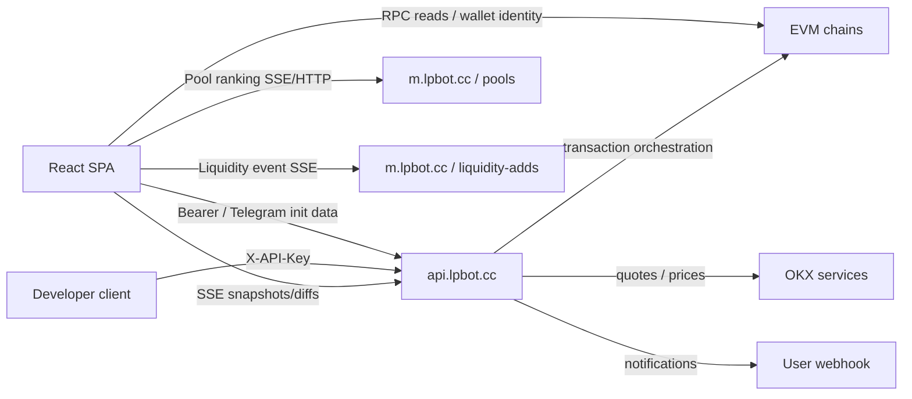
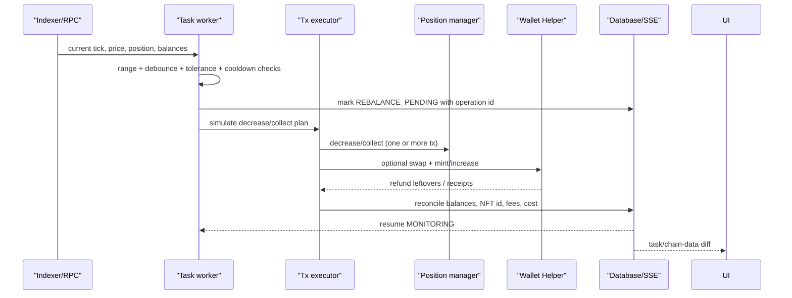

# LPBot 公开产品面、API 与前端 Bundle 研究

> 研究对象：[`https://www.lpbot.cc/`](https://www.lpbot.cc/)、[`https://api.lpbot.cc/api/docs`](https://api.lpbot.cc/api/docs)  
> 观察时间：2026-08-13（Asia/Shanghai）  
> 证据范围：第一方网页、第一方静态资产、第一方 API 文档、正常登录用户可见页面、无需鉴权的只读 SSE  
> 关联链上研究：[prior-thread.md](./prior-thread.md)

## 1. 结论摘要

- **[事实]** LPBot 是一个面向集中流动性 LP 的多链操作与自动化产品。正常用户产品面包含任务、池子发现、自动策略、活动日志、钱包、开发者 API、设置，以及全局聊天室抽屉。
- **[事实]** 任务面覆盖创建、启动、暂停、恢复、停止、停止并撤池、领取手续费、复投、立即移仓、换池、批量删除和配置复制；池子面覆盖手续费排行、实时流动性动向、监控、建池和快速初始流动性。
- **[事实]** 前端是 Vite 构建的 React SPA，核心技术指纹包括 React 18.3.1、React Router 7.18.2、Radix/shadcn 风格组件、Lucide、Sonner、`viem`、Wagmi/Reown AppKit、WalletConnect、`lightweight-charts` 和 `fetch-event-source`。
- **[事实]** 业务 API 位于 `api.lpbot.cc`；热门池与流动性事件数据面位于 `m.lpbot.cc`。响应头显示 Nginx 前置和 Express 应用。主站支持 Bearer/Telegram 登录态，开发者 API 文档要求 `X-API-Key`。
- **[事实]** 官方 API 文档公开 10 个类别、59 个端点；公开 Bundle 还包含认证、自动策略、聊天、管理员、收费 Hook 池、Helper 残留资产等未写入公开 API 文档的客户端调用。
- **[事实]** Pro/管理员能力不是一份可证实的独立“隐藏 Bundle”；相关 UI 和调用代码位于公开可下载的主 Bundle/懒加载 chunk 中，由用户角色、套餐和服务端链权限配置决定是否渲染。
- **[事实]** 主入口 `.js.map` URL 返回 SPA HTML，而不是 source map。研究只分析部署到公网的压缩资产和可见 UI，没有获得源码符号、服务端源码或数据库结构。
- **[推断]** 复现时应把产品拆成前端控制台、身份/钱包域、任务调度器、链适配器、交易编排器、行情与池索引器、通知服务、聊天服务、管理后台和合约注册表，而不是把所有链上逻辑塞入一个 Web API 进程。

## 2. 方法、边界与证据标记

### 2.1 方法

1. 下载主站 HTML、入口 JavaScript、CSS，以及入口 import graph 可枚举到的全部公开懒加载 chunk。
2. 从构建产物恢复路由、导航项、对话框、交互文案、API URL、角色判断、多链配置和第三方库指纹。
3. 使用正常用户会话只读浏览任务、池子、策略、钱包、日志、开发者和设置页面，用渲染结果校正 Bundle 结论。
4. 下载官方 API Markdown 和 JSON 表达，逐项整理方法、路径、请求字段、默认值与说明。
5. 对无需鉴权的数据面只做 GET/SSE 读取；没有提交写请求、签名交易、读取 cookies/localStorage、查看私钥或执行资金操作。

### 2.2 标记

- **[事实]**：可由本次第一方 HTML、Bundle、官方 API 文档、响应头或正常 UI 直接复核。
- **[推断]**：由客户端调用形状、事件节奏、链上交易模式和常见工程边界推导，尚未由服务端源码证明。
- **[未验证]**：需要 Pro/管理员账号、受控测试钱包、测试网交易、网络抓包或服务端资料才能确认。

### 2.3 重要限制

- “Bundle 中存在端点或 UI”只证明客户端具备调用/渲染代码，**不自动证明生产服务端仍开放、当前角色可访问或功能完整可用**。
- 正常用户页面的具体账号、钱包、任务、开发者 Key 前缀等敏感数据均未记录。
- 本文是 2026-08-13 的时间点快照。哈希文件名会随部署变化，不能作为长期固定接口。
- 未进行任何资金操作。所有改变资产或链上状态的流程仍需在本地链/fork 和测试网分层验证。

## 3. 一手来源与构建快照

### 3.1 第一方入口

| 来源 | 用途 |
|---|---|
| [`https://www.lpbot.cc/`](https://www.lpbot.cc/) | SPA HTML、PWA/Telegram 初始化、静态资产入口 |
| [`https://www.lpbot.cc/assets/index-CMScqdPv.js`](https://www.lpbot.cc/assets/index-CMScqdPv.js) | 主 Bundle、路由、公共 API 客户端、全局组件 |
| [`https://www.lpbot.cc/assets/index-D5EvLoZA.css`](https://www.lpbot.cc/assets/index-D5EvLoZA.css) | UI 样式与响应式布局 |
| [`https://api.lpbot.cc/api/docs`](https://api.lpbot.cc/api/docs) | 官方 API Markdown |
| [`https://api.lpbot.cc/api/docs.json`](https://api.lpbot.cc/api/docs.json) | 官方 API 结构化文档 |
| [`https://m.lpbot.cc/api/pools`](https://m.lpbot.cc/api/pools) | 池排行 SSE 基址；需查询参数和流式请求 |
| [`https://m.lpbot.cc/api/liquidity-adds/stream`](https://m.lpbot.cc/api/liquidity-adds/stream) | 实时加池、撤池、新池事件 SSE |

### 3.2 懒加载业务资产

**[事实]** 入口 import graph 中可枚举的主要页面/功能 chunk 如下：

| 资产 | 恢复出的职责 |
|---|---|
| `page-BPAnUeFz.js` | 任务列表、详情、批量和任务操作 |
| `page-C1lIAqW9.js` | 池子页入口与子视图装配 |
| `TopPoolsView-BMZTVRl8.js` | 热门池/手续费排行、筛选、比较、监控 |
| `LiquidityFlowSheet-CJQFRO9_.js` | 实时流动性动向 |
| `page-Crvypn-F.js` | 自动策略 |
| `page-jcxXPk4w.js` | 活动日志 |
| `page-B0Am6c6F.js` | 钱包与 LP 仓位操作 |
| `page-Cvb1NhIU.js` | 用户/管理员管理 |
| `page-rWgRMJ4w.js` | 开发者 API |
| `page-CKoF9uum.js` | 设置 |
| `CreateTaskDialog-BIz9n2cm.js` | 创建/编辑 LP 任务 |
| `QuickCreatePoolDialog-BqY5uf47.js` | 建池与快速初始流动性 |
| `AdvancedSettingsForm-Dd4p-usE.js` | 任务高级风控参数 |
| `RPCConfigDialog-Di2RtBc0.js` | 客户端 RPC 配置与连通性测试 |
| `WalletLoginArea-i1JZ8X_N.js` | 钱包签名登录 |
| `WalletLinkArea-BCXKvEn_.js` | 钱包身份绑定 |
| `AppKitProvider-CE-iOhLa.js` | Reown/Wagmi 钱包连接上下文 |
| `lightweight-charts.production-D92iNSL4.js` | K 线和时序图表 |

访问方式为 `https://www.lpbot.cc/assets/<文件名>`。文件名是当前部署快照，不应写死到产品代码。

### 3.3 内容哈希

| 抓取物 | SHA-256 |
|---|---|
| 主站 HTML | `af930df13d09a3ff69c2d46142759770be5ebd89fe4bb8d6f35adff3694c46cb` |
| 主入口 JS | `38b650657a7e02124eee52f1198e7479b3acdf43c0c6b82a47deb0c77d5bcd17` |
| 主 CSS | `d87e7fc5fada9b418d43cb40ee74f654944f05cc2cc60a4797042e2be1391bf7` |
| API Markdown | `3601b2b59fb5294f209bbcae3aec3b587eb8a92e0ddf22393f534c0d5bded5fa` |
| API JSON | `7ffae6b1582d781693e26cf41cfabf9542258858723a8d426d16df5afc6a1fa0` |

## 4. 页面、路由与交互矩阵

### 4.1 顶层路由

| 路由 | 访问条件 | 页面/行为 | 主要交互 |
|---|---|---|---|
| `/login` | 未登录 | 登录页 | Telegram Mini App、Bot 一次性链接轮询、钱包消息签名登录 |
| `/blocked` | 被拒绝/封禁 | 阻断页 | 显示访问状态，退出或重新登录 |
| `/maintenance` | 系统维护 | 维护页 | 显示维护信息并阻断业务路由 |
| `/` | 已登录 | 重定向 | 跳转 `/tasks/running` |
| `/tasks/running` | 已登录 | 运行中任务 | 创建、查看、暂停、停止、移仓、复投、领费、换池等 |
| `/tasks/paused` | 已登录 | 已暂停任务 | 恢复、停止、编辑、删除等 |
| `/tasks/stopped` | 已登录 | 已停止任务 | 启动、撤池、复制、删除等 |
| `/pools` | 已登录且链可用 | 池子发现 | 手续费排行、搜索筛选、流动性分布、实时动向、监控、建池 |
| `/strategies` | 已登录且链可用 | 自动策略 | 规则组、钱包分配、开关、导入导出、历史/PnL |
| `/activity` | 已登录 | 活动日志 | 时间/任务过滤、详情、状态追踪 |
| `/wallets` | 已登录 | 钱包与仓位 | 导入/生成、余额、Swap、转账、LP 扫描、领费、撤池、Helper 残留 |
| `/users` | 管理员 | 用户管理 | 审批、封禁、套餐/费率、任务/钱包、系统配置入口 |
| `/developer` | 已登录 | 开发者 API | 创建/撤销 Key、文档与调用说明 |
| `/settings` | 已登录 | 设置 | 外观、风险、RPC、通知、密钥保护、屏蔽、反馈等 |
| `/all/:status?` | 兼容旧链接 | 重定向 | 映射到新的任务状态路由 |
| `/*` | 任意 | 受保护应用壳/兜底 | 根据认证、封禁、维护状态重定向 |

**[事实]** `/users` 对普通用户会被导航守卫移回任务页。旧 `/monitors` 路由重定向到 `/pools`，说明监控已经合并到池子页。

### 4.2 全局应用壳

| 区域 | 功能 |
|---|---|
| 桌面侧栏/移动导航 | 任务、池子、策略、钱包、用户（管理员）、日志；开发者与设置由用户菜单进入 |
| 链选择 | 按 `allowedChains` 和服务端访问级别裁剪可用链 |
| 主题与布局 | 明暗主题、强调色、导航/布局选项，PWA `theme-color` 同步 |
| 全局状态 | 登录过期、封禁、维护响应会触发专用路由 |
| Toast/确认框 | 成功、失败、危险操作二次确认、异步进度 |
| 聊天室抽屉 | 最近会话、公共/项目房间、未读数、消息和红包；不是单独顶层路由 |
| 响应式 | 桌面/移动布局；Telegram Web App 直接读取 `initData` |

## 5. 功能域清单

### 5.1 登录、账号与钱包身份

- **[事实]** Telegram Mini App 可凭 Telegram `initData` 进入认证流程。
- **[事实]** 普通网页可申请 Telegram Bot 一次性登录 token，并轮询登录状态。
- **[事实]** 已绑定的钱包可通过 nonce + 消息签名登录；钱包连接/绑定用于身份验证，不等同于把浏览器钱包作为全部自动交易的签名器。
- **[事实]** Bundle 包含钱包链接列表、解绑、当前用户、锁定/解锁、设置/修改/重置密码和自动锁定时间的客户端调用。
- **[未验证]** Telegram token 生命周期、JWT refresh 机制、密码 KDF/加密算法、私钥最终保管介质、备份和管理员可见范围。

### 5.2 LP 任务

#### 页面与状态

- **[事实]** 任务按 `running`、`paused`、`stopped` 分页，支持列表/图表视图、搜索/筛选、选择和批量删除。
- **[事实]** 任务卡/详情展示钱包、链、DEX/协议、池地址、token、NFT ID、当前区间、运行健康、连续失败、上次成功、余额/仓位、未领取手续费、估值和历史曲线。
- **[事实]** K 线与价格/资产/PnL 历史使用图表组件，并可从任务跳到池/代币上下文。

#### 创建与配置

- **[事实]** 创建任务以池地址、链、钱包为核心输入，支持固定 USD 投入或 All-in。
- **[事实]** 区间可对称设置，也可分别设置下限/上限；其他参数包括滑点、检查间隔、超范围次数、价格偏差容差、价格影响上限、超范围持续时间和移仓冷却。
- **[事实]** 可选择超范围后移仓或撤出、撤出后保留双币/换成 token0/token1，以及止损/止盈监控 token 和百分比。
- **[事实]** 配置模板可新增、修改、删除和设为默认；任务配置可复制后新建。

#### 操作

| 操作 | 可见语义 |
|---|---|
| 启动/恢复 | 启动任务 worker 或从暂停状态恢复监控 |
| 暂停 | 暂停监控，不等同于撤出 LP |
| 停止 | 停止自动化，保留 LP 仓位 |
| 停止并撤池 | 停止后移除全部流动性 |
| 撤池并 Swap | 按选择方向将撤出资产换成单币 |
| 领取手续费 | 仅 collect 未领取手续费 |
| 领取并 Swap | collect 后按选择方向换币 |
| 立即移仓 | 手动触发当前任务 rebalance |
| 复投 | 以 token0、token1、双币、自定义数量或 USD 金额增加仓位 |
| 换池 | 迁移到指定新池/新平台，保留任务意图 |
| 编辑 | 修改运行参数；官方文档说明运行中任务会暂停后恢复 |
| 删除/批量删除 | 移除任务记录；运行任务删除前会停止 |

#### 工作链路

**[事实 + 历史链上证据]** 新钱包第一次执行需要 Helper 的操作时，产品 UI 把 Helper 描述为“一钱包一链一个、只限该地址使用、原子 Swap + 添加流动性、自动管理授权并退回余币”。历史 Helper 研究也观察到 owner 限制、V3/V4 Mint/Increase、Swap、收费和退款。

**[推断]** 稳健的任务状态机至少需要：

```text
DRAFT -> STARTING -> ENSURE_HELPER -> FUND/APPROVE -> MINT_OR_ATTACH
      -> MONITORING -> OUT_OF_RANGE_PENDING -> REBALANCING -> MONITORING
      -> PAUSED | STOPPING -> WITHDRAWING -> OPTIONAL_SWAPS -> STOPPED
```

每个链上步骤需记录 idempotency key、nonce、tx hash、确认数、预期/实际余额、失败分类和恢复游标。历史样本显示“撤出并换币”可能是 PositionManager 调用后跟多笔 Swap，并非所有退出动作都由旧 Helper 原子完成。

### 5.3 热门池与手续费排行

- **[事实]** 支持链选择、5/15/30/60 分钟窗口、DEX 多选、地址/代币搜索、排序和列显示配置。
- **[事实]** 指标包括交易量、手续费、Fee/TVL、Fee/活跃 TVL、TVL、交易次数、协议版本和短周期趋势。
- **[事实]** 可进行高级筛选、同币池合并、池对比、关注/屏蔽、流动性 Tick 分布、K 线查看和 Hook 风险特征解析。
- **[事实]** 搜索既支持池地址，也支持 token 地址关联池查询；V4 流动性查询需要 DEX、tick spacing 与 token decimals。
- **[事实]** 排行数据使用 `m.lpbot.cc/api/pools` 的 SSE 快照/差异流，HTTP `/api/pools/top-fees` 和 `/api/pools/by-token` 用于补充查询。
- **[推断]** `m.lpbot.cc` 是独立行情/索引服务，按链消费池事件和 Swap/流动性数据，维护时间窗聚合后通过 SSE 广播。数据源、去重算法、reorg 处理和活跃 TVL 公式仍需抓包/服务端材料确认。

### 5.4 池监控与外部通知

- **[事实]** 用户可以创建、更新、删除监控，并查看通知历史或发送测试通知。
- **[事实]** 条件覆盖交易量、手续费、Fee/TVL、Fee/活跃 TVL、TVL、交易次数、协议版本，并可排除中文 token 或 Hook 池。
- **[事实]** 外部通知支持 GET 或 POST；POST 可配置请求体模板。
- **[未验证]** 触发去重、冷却、签名、防 SSRF、失败重试、投递超时和模板变量全集。

### 5.5 实时流动性动向

- **[事实]** `m.lpbot.cc/api/liquidity-adds/stream` 无需业务登录即可返回 `text/event-stream`。
- **[事实]** 已观察事件字段包含链、V3/V4、DEX、费率、池地址、add/remove、token、用户地址、NFT ID、ticks、数量、USD 价值、是否在区间、Hook、交易哈希和时间戳。
- **[事实]** UI 支持实时加池、撤池、新池事件，地址聚合、关注、备注、过滤和历史回填。
- **[推断]** 客户端有断线重连和短窗口回填；服务端需要用稳定事件 ID 处理重连重复与链重组。

### 5.6 自动策略

- **[事实]** 策略分开仓和关仓规则。组内条件为 AND，组间为 OR。
- **[事实]** 可用条件覆盖市场与仓位指标、标签包含/排除、币安现货/Alpha 状态等；可设置 Hook 排除。
- **[事实]** 执行设置包含钱包分配、固定资金/All-in、最大并发、冷却、投入上限和任务参数。
- **[事实]** 支持激活/停用、任务历史、PnL、导入和导出。
- **[事实]** 当前 UI 明确标注该功能高风险且尚未完整测试；复刻验收不能把页面存在等同于生产可托管资金。
- **[推断]** 后端需要策略评估器、候选池 feed、规则 DSL、资金/钱包锁、全局并发限制、策略到任务的关联和幂等开平仓 saga。

### 5.7 钱包、余额与 LP 仓位

- **[事实]** 支持生成钱包和导入私钥、命名/删除、余额查询、额外 token 导入、原生币/ERC-20 转账和 Swap。
- **[事实]** UI 暴露服务端加密模式与用户密码加密模式，并提供 keystore 状态、锁定/解锁和安全密码设置。
- **[事实]** 支持扫描 V3/V4 LP NFT、查看仓位、领取手续费、部分/全部撤池，并维护定价仓位台账及“已撤出”状态。
- **[事实]** 支持 Helper 残留资产列表、扫描和提取；地址簿与地址备注也有客户端调用。
- **[事实]** Helper 以钱包/链维度显示部署状态和版本；产品文案明确表示不同链版本号不可直接比较功能多少。
- **[未验证]** 私钥是否始终由服务端持有、用户密码模式的密文位置、解密会话驻留时间、密钥轮换和灾难恢复。

### 5.8 建池与初始流动性

- **[事实]** 普通入口支持 Uniswap/PancakeSwap 的 V3/V4 池创建，输入 token0/token1、费率、链、钱包；V4 可设置 tick spacing。
- **[事实]** “快速添加流动性”是一次性操作，不创建持续任务；官方 API 限制 `amountUsd <= 100`、`tickRange <= 200`。
- **[事实]** UI 提供“一键创建 + 初始流动性”的组合工作流和创建历史。
- **[事实]** Bundle 存在 BSC Uniswap V4 白名单私有池创建，以及 Pro/管理员可见的收费 Hook 池创建、池费率修改和 LP 费率修改。
- **[推断]** 建池 saga 应拆为 token 顺序规范化、池存在性检查、创建/initialize、确认、估价与配比、Helper/授权、Mint、退款和索引确认。任一步失败都应能从交易哈希恢复，而不是整段重跑。

### 5.9 聊天室与红包

- **[事实]** 公共和项目代币聊天室通过全局抽屉进入，支持最近房间、未读状态、消息 SSE、文本、图片/媒体、回复、反应、举报和禁言。
- **[事实]** 红包支持发送、领取和退款；管理员 Bundle 中有红包合约部署入口。
- **[事实]** 管理端包含举报处理、消息/媒体审核、禁言/解禁和 LP 徽章隐藏配置。
- **[未验证]** 红包托管合约、领取资格、防抢跑、退款时限、媒体存储和内容审核服务。

### 5.10 日志、统计与开发者 API

- **[事实]** 活动页提供最近日志和按任务日志，任务/链上操作可追踪状态和错误。
- **[事实]** 统计 SSE 同时传系统统计与推荐池；统计用事件更新，推荐池约 5 秒一轮，25 秒心跳。
- **[事实]** 开发者 API 每用户当前限制一个 Key；列表只返回前缀，创建时返回完整值，删除立即失效。
- **[事实]** 官方文档的开发者调用认证为 `X-API-Key`。
- **[未验证]** Key scopes、限流配额、审计日志、IP 白名单和回放防护。

### 5.11 设置

| 分组 | 已观察能力 |
|---|---|
| 外观 | 明暗/跟随系统、强调色/自定义色、布局与导航偏好 |
| 风控 | 全局风险参数、冷池保护、冷静期、价格偏差/冲击类设置 |
| 自动化 | 自动补仓、失败重试与相关策略偏好 |
| 屏蔽 | token/池/地址相关屏蔽与偏好 |
| RPC | 每链预设/自定义 RPC、测试、恢复默认；配置在客户端生效 |
| OKX | 用户 OKX Key 状态/配置；管理员另有 Key 池 |
| 密钥保护 | keystore 密码、修改/重置、自动锁定、用户安全密码 |
| 通知 | 通知偏好、失败通知 URL/测试、池监控通知 |
| 反馈 | bug/feature/other 提交、状态、管理员回复 |
| 开发者 | API Key 与文档入口 |

## 6. Pro、管理员与条件开放功能

### 6.1 访问控制模型

- **[事实]** 服务端返回 `allowedChains`；管理员链配置可将每条链设为 `off`、`pro` 或 `all`。
- **[事实]** 前端用户层级至少包括普通用户和 `pro`，另有管理员角色。
- **[事实]** 收费 Hook 池入口的渲染条件为管理员或 `tier === "pro"`。
- **[事实]** 管理页面和多数管理 API 即使代码可下载，也由服务端鉴权决定是否可调用。

### 6.2 条件功能矩阵

| 能力 | 普通用户 | Pro | 管理员 | 证据与状态 |
|---|---:|---:|---:|---|
| 基础任务/钱包/池排行/日志 | 是 | 是 | 是 | 正常用户 UI 已核对 |
| 链访问 | 按 `all` | `all` + `pro` | 管理配置 | Bundle 角色与链级配置 |
| 自动策略 | 条件开放 | 条件开放 | 可管理 | 页面存在；具体套餐门槛需账号核对 |
| BSC UniV4 私有白名单池 | 条件开放 | 条件开放 | 是 | Bundle 中存在客户端入口 |
| 收费 Hook 池创建 | 否 | 是 | 是 | 明确 Pro/admin 条件 |
| 收费池费率/LP 费率调整 | 否 | 条件开放 | 是 | Bundle 中存在调用；权限细节未验证 |
| 用户审批/拒绝/删除/封禁 | 否 | 否 | 是 | 管理员页面 chunk |
| Pro 升降级、免佣、自定义费率 | 否 | 否 | 是 | 管理员 API 客户端 |
| 用户冷静期、钱包/任务查看 | 否 | 否 | 是 | 管理员 API 客户端 |
| 活动热力图 | 否 | 否 | 是 | 管理员用户页 |
| 维护模式、链级访问、抽佣配置 | 否 | 否 | 是 | 系统/维护配置调用 |
| RPC/mempool、OKX Key 池 | 否 | 否 | 是 | 管理端 Bundle 调用 |
| 反馈回复/关闭 | 否 | 否 | 是 | 管理端反馈调用 |
| 聊天审核、禁言、红包合约部署 | 否 | 否 | 是 | 聊天管理调用 |

**[未验证]** 没有 Pro 或管理员账号，本表中的专属页面布局、所有表单默认值、服务端错误行为、审计记录和端到端成功路径均需在后续专用账号上验收。根据 Bundle 推出来的入口可以用于建立需求基线，不能代替产品操作证据。

## 7. 多链与协议矩阵

**[事实]** 当前 Bundle 注册以下链：

| Chain ID | 链 | 公开前端协议配置 |
|---:|---|---|
| `56` | BNB Smart Chain | Uniswap V3、PancakeSwap V3、Uniswap V4、PancakeSwap V4/Infinity |
| `8453` | Base | 主要为 Uniswap V3/V4 |
| `1` | Ethereum | 主要为 Uniswap V3/V4 |
| `4663` | Robinhood Chain | 公开配置以 Uniswap V3/V4 适配为主 |
| `196` | X Layer | 公开配置以 Uniswap V3/V4 适配为主 |

- **[事实]** 实际可用链由服务端 `allowedChains` 和链级 `off/pro/all` 再裁剪。
- **[事实]** API 文档中部分排行端点仍只列 BSC/Base，而 stats/monitor 文档列到 ETH/Robinhood；文档和 Bundle 的链覆盖不是完全同步。
- **[推断]** 应建立带生效区块和版本的链配置注册表，至少记录 RPC、explorer、wrapped native、factory、position/pool manager、Permit2、quoter/router、Helper bytecode/version、fee collector 和启用功能，不在业务代码中散落地址。

## 8. 技术架构与工作链路

### 8.1 可直接确认的前端架构

```text
Vite SPA
  React 18.3.1 + React Router 7.18.2
  Radix/shadcn-style UI + Lucide + Sonner
  lightweight-charts
  viem + Wagmi/Reown AppKit + WalletConnect
  fetch-event-source (带 Authorization header 的 SSE)
  Telegram Web App SDK + PWA manifest
```

- **[事实]** 页面与重型对话框通过动态 `import()` 拆包；HTML 内置 chunk 加载失败自救，捕获静态资产 error、动态 import rejection 和 `vite:preloadError`，一分钟内只刷新一次。
- **[事实]** Telegram SDK 同步加载，以保证组件挂载时能读取 `window.Telegram.WebApp.initData`。
- **[事实]** 主题色在首屏渲染前读取本地偏好，避免 PWA 状态栏闪色；`?debug=1` 可加载 Eruda 移动调试面板。
- **[事实]** `.js.map` 请求返回 `text/html` 的 SPA 入口，不是有效 source map；没有证据存在另一套可枚举的管理员专用静态构建。

### 8.2 可直接确认的服务边界



- **[事实]** `api.lpbot.cc` 和 `m.lpbot.cc` 响应头均显示 `X-Powered-By: Express`，前置服务器为 Nginx。
- **[事实]** `/api/tasks/stream` 合并任务、活跃 token 价格和链上数据：任务约 5 秒、价格约 2 秒、链数据约 3 秒，以 snapshot/diff 推送并有 25 秒心跳。
- **[事实]** `/api/stats/stream` 合并事件驱动统计和约 5 秒推荐池快照。
- **[推断]** SSE 只是读模型传输层；链上写操作需要独立队列/worker、钱包级 nonce 串行器和持久化 saga，否则 Web 进程重启会丢失中间状态。

### 8.3 建议复现的后端模块边界

| 模块 | 核心职责 | 为什么单独存在 |
|---|---|---|
| Identity & Access | Telegram、钱包签名、JWT/API Key、套餐、管理员 RBAC | 与私钥托管、业务权限分离 |
| Wallet Vault | 钱包生成/导入、加密、解锁会话、签名、轮换 | 最高敏感边界，独立审计 |
| Chain Registry | 链/协议/合约/Helper 版本与生效区块 | 防止跨链硬编码漂移 |
| Pool Indexer | Pool/Swap/Mint/Burn/Modify 事件、reorg、token metadata | 支撑排行和策略，不依赖前端临时查询 |
| Metrics Engine | 5/15/30/60 分钟聚合、Fee/TVL、aTVL、趋势 | 可重算、可验证公式 |
| Task Orchestrator | 任务状态机、监控、移仓/复投/撤出 saga | 长事务、失败恢复和幂等 |
| Tx Executor | simulation、gas/nonce、签名、广播、确认、对账 | 钱包级串行与链错误隔离 |
| Helper Registry/Deployer | 钱包/链 Helper 部署、版本、升级和残留提取 | 对齐一钱包一 Helper 模型 |
| Strategy Engine | 规则 DSL、候选池、风控、并发/资金配额 | 与单任务运行器解耦 |
| Notification | 监控匹配、模板、Webhook/Telegram、重试 | 外部 I/O 与 SSRF 防护 |
| Chat/Redpacket | 房间、消息、媒体、审核、链上红包 | 与交易任务隔离故障域 |
| Read API + SSE | REST、snapshot/diff、回放游标、心跳 | 面向 UI 的读模型 |
| Admin | 用户、费率、链开关、维护、RPC/OKX 池、审核 | 强 RBAC 和完整审计 |

### 8.4 自动移仓参考链路



**[推断]** 超范围次数、持续时间、偏差容差和冷却应全部成为持久化触发状态；只在内存计数会在重启后错误触发或漏触发。每次执行前应再次读池 tick、模拟价格影响并验证 min amounts。

### 8.5 复投参考链路

1. **[事实]** 前端先读取 `reinvest-info`，展示余额、未领取手续费和 USD 估值。
2. **[推断]** worker 锁定 task/wallet，重新读取链上 owner、NFT、liquidity、tokens owed 和余额。
3. **[推断]** 根据 `token0/token1/both/custom/usd` 计算可用资金和目标比例，生成 swap + increase plan。
4. **[历史事实]** Helper 的 V3/V4 Increase 路径可在 Swap 后增加既有 NFT 流动性并退款。
5. **[推断]** receipt 对账后更新投入成本、手续费来源和 PnL，避免把转入本金误记为收益。

## 9. 官方公开 API：59 个端点

**[事实]** 下表由 2026-08-13 下载的官方 [`/api/docs`](https://api.lpbot.cc/api/docs) 整理。`*` 表示官方文档标记的必填字段。基础 URL 为 `https://api.lpbot.cc`，开发者调用使用 `X-API-Key`。

### 任务管理
| Method | Path | Request schema | Notes |
|---|---|---|---|
| `GET` | `/api/tasks/stream` | `user_id`:string - 管理员可选，按用户 telegram_id 过滤 | 任务列表 + 活跃 token 价格 + 链上数据合并 SSE 推送。tasks 走 snapshot/diff（5s tick + 事件触发）；价格走 prices_snapshot/prices_diff（2s tick，仅活跃任务 token）；链上数据走 chain_data_snapshot/chain_data_diff（3s tick，按 taskId 字段级 diff）；25s 心跳。 |
| `GET` | `/api/tasks` | - | 获取所有任务；响应为 camelCase，非运行任务的实时字段为空/默认值。 |
| `GET` | `/api/tasks/running` | - | 仅返回运行任务，包含 positionManager / poolManager / uptimeMs。 |
| `GET` | `/api/tasks/:taskId` | - | 单任务详情；health 仅在 isRunning=true 时返回对象。 |
| `POST` | `/api/tasks` | `poolAddress`*:string - 池地址<br>`presetKeyId`*:number - 钱包 ID<br>`tickRange`:number - 区间 %（默认 3）<br>`tickRangeLower`:number - 非对称下限 %<br>`tickRangeUpper`:number - 非对称上限 %<br>`slippage`:number - 滑点 %（默认 1.5）<br>`checkInterval`:number - 检查间隔 ms（默认 1000）<br>`maxOutOfRangeCount`:number - 超范围阈值（默认 15）<br>`fixedAmountUsd`:number - 固定投入 USD（不传为全部余额）<br>`withdrawAction`:string - token0 / token1 / none<br>`outOfRangeAction`:string - rebalance / withdraw<br>`chainId`:number - 默认 56 | 创建任务，创建后手动启动。 |
| `POST` | `/api/tasks/:taskId/start` | - | 启动任务。 |
| `POST` | `/api/tasks/:taskId/stop` | - | 停止任务，保留 LP。 |
| `POST` | `/api/tasks/:taskId/pause` | - | 暂停监控。 |
| `POST` | `/api/tasks/:taskId/resume` | - | 恢复监控。 |
| `POST` | `/api/tasks/:taskId/stop-withdraw` | - | 停止并撤出全部流动性。 |
| `PATCH` | `/api/tasks/:taskId` | `tick_range`:number<br>`tick_range_lower`:number<br>`tick_range_upper`:number<br>`slippage`:number<br>`check_interval`:number<br>`max_out_of_range_count`:number<br>`withdraw_action`:string - token0 / token1 / none<br>`out_of_range_action`:string - rebalance / withdraw<br>`monitor_token`:string - token0 / token1 / null<br>`stop_loss_percent`:number/null<br>`take_profit_percent`:number/null | 更新配置；运行中会自动暂停再恢复。 |
| `DELETE` | `/api/tasks/:taskId` | - | 删除任务，运行中会先停止。 |
| `POST` | `/api/tasks/batch-delete` | `taskIds`*:number[] | 批量删除任务。 |
| `POST` | `/api/tasks/:taskId/rebalance` | - | 手动触发移仓。 |
| `POST` | `/api/tasks/:taskId/reinvest` | `mode`*:string - token0 / token1 / both / custom / usd<br>`customAmounts`:object - { amount0, amount1 }<br>`usdAmount`:number | 复投手续费/余额。 |
| `GET` | `/api/tasks/:taskId/reinvest-info` | - | 获取复投余额、手续费和 USD 信息。 |
| `POST` | `/api/tasks/:taskId/migrate` | `newPoolAddress`*:string<br>`newPlatform`:number - 可选，自动检测 | 迁移到新池。 |

### 钱包管理
| Method | Path | Request schema | Notes |
|---|---|---|---|
| `GET` | `/api/preset-keys` | `token0`:string<br>`token1`:string<br>`chainId`:number - 默认 56<br>`includeNative`:string - "1" 包含原生币 | 获取预设钱包；可附带 token 余额。 |
| `POST` | `/api/preset-keys` | `name`*:string<br>`privateKey`*:string | 添加预设钱包，私钥加密存储。 |
| `PATCH` | `/api/preset-keys/:keyId` | `name`*:string | 更新名称。 |
| `DELETE` | `/api/preset-keys/:keyId` | - | 删除钱包。 |
| `GET` | `/api/wallets/:address/balances` | `tokens`:string - 逗号分隔<br>`chainId`:number - 默认 56 | 查询代币余额。 |
| `GET` | `/api/wallets/:address/positions` | `limit`:number - 默认 20<br>`chainId`:number - 默认 56 | 查询 LP NFT 仓位。 |
| `POST` | `/api/wallets/transfer` | `presetKeyId`*:number<br>`toAddress`*:string<br>`tokenAddress`*:string - 原生币用 0xEeee...EEeE<br>`amount`*:string<br>`chainId`:number<br>`idempotencyKey`*:string | 转账代币。 |

### 仓位操作
| Method | Path | Request schema | Notes |
|---|---|---|---|
| `POST` | `/api/positions/collect-fees` | `presetKeyId`*:number<br>`nftId`*:string<br>`protocol`*:string - uniswap / pancakeswap<br>`version`:string - v3 / v4<br>`chainId`:number | 收取仓位手续费。 |
| `POST` | `/api/positions/remove-liquidity` | `presetKeyId`*:number<br>`nftId`*:string<br>`protocol`*:string<br>`percent`:number - 1-100，默认 100<br>`version`:string - v3 / v4<br>`slippage`:number<br>`chainId`:number | 移除仓位流动性。 |

### Swap
| Method | Path | Request schema | Notes |
|---|---|---|---|
| `POST` | `/api/swap/quote` | `presetKeyId`*:number<br>`fromToken`*:string<br>`toToken`*:string<br>`amount`*:number<br>`slippage`:number - 默认 1<br>`chainId`:number<br>`idempotencyKey`*:string | 获取 Swap 报价。 |
| `POST` | `/api/swap/execute` | `presetKeyId`*:number<br>`fromToken`*:string<br>`toToken`*:string<br>`amount`*:number<br>`slippage`:number - 默认 1<br>`chainId`:number | 执行 Swap。 |

### 池子与市场
| Method | Path | Request schema | Notes |
|---|---|---|---|
| `GET` | `/api/pools/info` | `address`*:string | 获取池详情。 |
| `POST` | `/api/pools/create` | `platform`*:string - uniswap / pancakeswap<br>`token0`*:string<br>`token1`*:string<br>`feePercent`*:string - 0.01/0.05/0.25/0.3/1<br>`presetKeyId`*:number<br>`chainId`:number<br>`tickSpacing`:number - V4 可选 | 创建新池。V4 留空 tickSpacing 时按费率推导；V3 忽略。 |
| `POST` | `/api/pools/quick-liquidity` | `poolAddress`*:string<br>`presetKeyId`*:number<br>`amountUsd`*:number - 最大 100<br>`tickRange`*:number - 最大 200<br>`mintPlatform`:number - 1/2/4/5<br>`chainId`:number | 一次性快速添加流动性，不创建任务。 |
| `POST` | `/api/okx/price` | `tokens`*:string[]<br>`chainIndex`:string - 默认 "56" | 获取 token USD 价格。 |
| `GET` | `/api/market/candles` | `token`*:string<br>`bar`:string - 1m/5m/15m/1H/4H/1D<br>`limit`:number - 默认 100，最大 299<br>`chainId`:number | 获取 K 线。 |
| `GET` | `/api/tokens/:address` | `chainId`:number | 获取 token 信息。 |
| `GET` | `/api/pools/top-fees/:minutes` | `chain`*:string - bsc / base<br>`dex`*:string - pcsv3,univ3,pcsv4,univ4 | 手续费池排行；分钟支持 1/5/15/30/60。 |
| `GET` | `/api/pools/by-token/:address` | `chain`*:string - bsc / base<br>`dex`*:string | 按 token 搜索相关池。 |
| `GET` | `/api/pools/liquidity/:poolAddress` | `range`:number - 默认 15，5-50<br>`chain`:string<br>`dex`:string - V4 必传<br>`tickSpacing`:number - V4 必传<br>`decimals0`:number<br>`decimals1`:number | 获取 Tick 流动性分布。 |

### 统计与日志
| Method | Path | Request schema | Notes |
|---|---|---|---|
| `GET` | `/api/stats` | - | 系统统计。 |
| `GET` | `/api/stats/stream` | `user_id`:string - 管理员过滤<br>`chain`:string - bsc/base/eth/robinhood，逗号分隔<br>`limit`:number - 默认 3，最大 20 | 统计 + 推荐池 SSE；stats snapshot/update，推荐池约 5s，25s 心跳。 |
| `GET` | `/api/activity-logs` | `limit`:number - 默认 500 | 活动日志。 |
| `GET` | `/api/activity-logs/task/:taskId` | `limit`:number - 默认 100 | 任务日志。 |
| `GET` | `/api/cooldown` | - | 查询冷静期。 |
| `POST` | `/api/cooldown` | `durationMs`*:number - 最长 7 天 | 设置冷静期。 |

### 配置模板
| Method | Path | Request schema | Notes |
|---|---|---|---|
| `GET` | `/api/config-templates` | - | 模板列表。 |
| `POST` | `/api/config-templates` | `name`*:string<br>`slippage`:number<br>`checkInterval`:number<br>`maxOutOfRangeCount`:number | 创建模板。 |
| `PUT` | `/api/config-templates/:id` | `name`:string<br>`slippage`:number<br>`checkInterval`:number<br>`maxOutOfRangeCount`:number | 更新模板。 |
| `DELETE` | `/api/config-templates/:id` | - | 删除模板。 |
| `PUT` | `/api/config-templates/:id/default` | - | 设为默认模板。 |

### 开发者 Key
| Method | Path | Request schema | Notes |
|---|---|---|---|
| `GET` | `/api/developer-keys` | - | 获取当前 Key，仅返回前缀。 |
| `POST` | `/api/developer-keys` | - | 创建 Key，每用户限一个。 |
| `DELETE` | `/api/developer-keys/:keyId` | - | 删除并立即失效。 |

### 池子监控
| Method | Path | Request schema | Notes |
|---|---|---|---|
| `GET` | `/api/pool-monitors` | - | 监控列表。 |
| `POST` | `/api/pool-monitors` | `name`*:string<br>`chain`:string - bsc/base/eth/robinhood/all<br>`notificationUrl`:string<br>`notificationMethod`:string - GET/POST<br>`notificationBody`:string<br>`conditions`:object | 创建监控。 |
| `PATCH` | `/api/pool-monitors/:monitorId` | - | 更新监控。 |
| `DELETE` | `/api/pool-monitors/:monitorId` | - | 删除监控。 |
| `POST` | `/api/pool-monitors/test-notification` | `notificationUrl`*:string<br>`notificationMethod`:string - GET/POST | 测试通知。 |
| `GET` | `/api/pool-notifications` | `limit`:number - 默认 50 | 通知历史。 |

### 用户反馈
| Method | Path | Request schema | Notes |
|---|---|---|---|
| `POST` | `/api/feedback` | `type`:string - bug/feature/other<br>`content`*:string - 最多 2000 字 | 提交反馈；60s 内最多 3 条。 |
| `GET` | `/api/feedback` | - | 我的反馈，状态 open/replied/closed。 |

## 10. Bundle 中存在但未写入公开 API 文档的调用

**[事实]** 下表表示当前客户端代码存在这些功能族和 URL 形状；它们属于站内 API，不是公开开发者契约。不要据此承诺兼容性，也不要在未授权角色下尝试调用管理端点。

| 功能族 | Bundle 中的代表性路径 | UI/用途 | 结论 |
|---|---|---|---|
| 当前认证 | `/api/auth/me`、`/auth/login-token`、`/auth/login-status/:token` | Telegram Bot 登录和会话恢复 | 站内认证契约 |
| 钱包签名认证 | `/auth/wallet/nonce`、`/auth/wallet/login` | 钱包消息签名登录 | 站内认证契约 |
| 钱包身份绑定 | `/auth/wallet/link-nonce`、`/auth/wallet/link`、`/auth/wallet/links`、`/auth/wallet/link/:id` | 绑定列表、绑定/解绑 | 站内认证契约 |
| Keystore/锁定 | `/auth/keystore-status`、`set-password`、`change-password`、`reset-preview`、`reset-password`、`lock`、`unlock`、`auto-lock-minutes` | 用户密码模式与自动锁 | 算法与服务端存储未公开 |
| 钱包扩展 | `/preset-keys/generate`、`/preset-keys/:id/encryption-mode` | 生成钱包、切换加密模式 | 未列入开发者文档 |
| 地址簿/备注 | `/address-book`、`/address-book/:id`、`/address-remarks/:address` | 地址簿和流动性地址备注 | 未列入开发者文档 |
| Helper 残留 | `/wallets/helper-residuals`、`scan`、`sweep` | 扫描/提取 Helper 余币 | 高风险写操作，需测试网验收 |
| LP/定价扫描 | `/positions/scan/:wallet`、`/pricing-positions`、`import`、`stream`、`/:id/withdrawn` | 仓位发现和成本/PnL 台账 | 数据模型未公开 |
| 任务扩展 | `/tasks/:id/collect-fees`、`/chain-data`、`/cooldown/check`、`/fees/quote` | 领费、链数据、冷静期、产品收费报价 | 未列入开发者文档 |
| 池分析 | `/pools/analyze`、`/market/token-liquidity`、`/tokens/logos` | Hook/池风险、token 流动性、logo | 未列入开发者文档 |
| 私有/收费池 | `/pools/create-private`、`/create-fee-hook`、`/fee-hook`、`/fee-hook-lp`、`/create-history`、`/fee-hooks` | 私有池、收费 Hook 池、费率调整、历史 | 条件渲染，服务端权限未验证 |
| 自动策略 | `/auto-strategies`、`/:id`、`/:id/activate`、`deactivate`、`tasks` | 策略 CRUD、启停和任务历史 | 页面明确高风险/未完整测试 |
| 聊天消息 | `/chat/config`、`rooms/recent`、`messages`、`stream`、`read`、`unread` | 房间、历史、SSE、已读/未读 | 站内实时服务 |
| 聊天互动 | `/chat/messages/:id/react`、`report`、`mute`、`unmute`、`images`、`media` | 反应、举报、禁言、媒体 | 审核和存储未公开 |
| 红包 | `/chat/redpacket/send`、`/:id/claim`、`/:id/refund` | 发、领、退红包 | 合约与风控未公开 |
| 通知偏好 | `/notify-prefs`、`/failure-notification-config`、`/test` | 用户通知和失败通知测试 | 未列入开发者文档 |
| 用户偏好 | `/user/preferences`、`/pool-notifications` | UI/池偏好和通知历史 | 未列入开发者文档 |
| 用户管理 | `/users`、`search`、`find-by-addresses`、`/:id/{approve,reject,ban,unban,note,tier,fee-exempt,fee-rate}` | 审批、封禁、套餐和费率 | 管理员契约 |
| 用户审计 | `/users/:id/wallets`、`/:id/tasks`、`/users/activity-heatmap`、`/stats/activity-summary` | 钱包/任务查看和活跃度 | 管理员契约 |
| 系统管理 | `/system-config`、`/system-config/chains`、`/admin/maintenance` | 抽佣/系统参数、链权限、维护模式 | 管理员契约 |
| 基础设施管理 | `/admin/rpc-config`、`test`、`/admin/mempool-config`、`test` | 服务端 RPC 与 mempool 配置 | 管理员契约 |
| OKX Key | `/okx/keys`、`status`、`/okx/key-pool`、`import`、`test`、`/:id` | 用户 Key 与管理员 Key 池 | 密钥安全边界未公开 |
| 管理反馈 | `/admin/feedback`、`/:id`、`/:id/reply` | 回复/关闭用户反馈 | 管理员契约 |
| 聊天管理 | `/chat/reports`、`/:id/dismiss`、`/admin/redpacket/deploy`、`/chat/hide-lp-badge` | 举报处理、红包合约、徽章配置 | 管理员契约 |
| 其他代理 | `/api/v5/explorer/xlayer/api`、`/social/image` | X Layer explorer 代理、社交图片代理 | 用途可见，服务端限制未公开 |

## 11. 未验证项与下一轮登录验收清单

### 11.1 普通用户账号

- [ ] 记录每个路由的桌面、移动、明/暗主题截图和空/加载/错误/有数据状态。
- [ ] 对创建任务向导逐字段记录默认值、校验、联动、帮助文案和最终 request body；在提交前停止。
- [ ] 对任务的每个菜单项记录可用状态矩阵和所有确认框，不执行资金动作。
- [ ] 对池排行的每个列、排序、筛选、比较、屏蔽、关注、监控表单进行 UI 快照和网络只读抓包。
- [ ] 对自动策略导出一个无资金测试配置，恢复完整规则 schema；导入仅用本地导出的无害样本。
- [ ] 核对钱包加密模式切换前后的 UI/网络字段，但不输入或导出真实私钥。
- [ ] 核对聊天的房间类型、媒体限制、举报和红包表单；红包不提交。
- [ ] 导出通知/偏好/反馈的字段 schema，并核对 API 文档与实际响应差异。

### 11.2 Pro 账号

- [ ] 验证 Pro 可用链、收费 Hook 池入口和普通账号差异。
- [ ] 完整记录收费 Hook 建池向导、费用公式、可调范围、收款方和合约地址展示。
- [ ] 验证私有池白名单的来源、增删流程、链/DEX 限制和失败提示。
- [ ] 验证 Pro 是否改变自动策略、监控数量、任务数量、费率或 API 配额。

### 11.3 管理员账号

- [ ] 截图并记录 `/users` 的全部 tab、列、筛选、批量动作和详情抽屉。
- [ ] 读取但不修改链级 `off/pro/all`、抽佣、维护、RPC、mempool、OKX Key 池配置。
- [ ] 验证用户审批、封禁、tier、fee exempt/rate、冷静期的确认框和审计日志格式。
- [ ] 验证反馈和聊天举报队列、媒体预览、处理状态以及红包合约部署表单。
- [ ] 记录所有管理写 API 的 CSRF/幂等/权限错误行为；不对生产状态提交修改。

### 11.4 受控测试网/本地 fork

- [ ] 用专用无资产钱包验证生成/导入、加密、锁定、重置和删除全生命周期。
- [ ] 为每条支持链验证 Helper 首次部署、owner 限制、版本登记、重复启动不重复部署。
- [ ] 覆盖 V3/V4 的 create/initialize、Mint、Increase、Collect、Decrease、Burn、Swap、退款。
- [ ] 覆盖对称/非对称区间、单边资产、All-in、固定金额、余额不足、报价过期和滑点失败。
- [ ] 人工推动价格超范围，验证次数/持续时间/容差/冷却、重启恢复、重复事件和链 reorg。
- [ ] 注入 RPC 超时、nonce 冲突、revert、只确认一半的多交易 saga，验证恢复和对账。
- [ ] 所有资产写操作先在本地 fork，再在官方测试网；任何主网小额操作需单独批准并明确最大损失。

## 12. 更新监测与差异流程

### 12.1 每次发布检测

1. 抓取主站 HTML，解析模块入口和 CSS 文件名；保存 UTC/本地时间、ETag、Last-Modified、SHA-256。
2. 比较入口 JS hash；若变化，重新解析静态/dynamic imports，下载全部新 chunk，不假设旧文件仍存在。
3. 对格式化后的 Bundle 做语义 diff：路由、导航、中文文案、API URL、chain ID、platform ID、feature gate、角色/tier 判断。
4. 抓取 `/api/docs` 和 `/api/docs.json`，按 `method + path` 生成结构化 diff，分别报告新增、删除和字段变化。
5. 在测试账号上运行只读 UI smoke：所有路由能加载、无 chunk error、SSE 能重连、无权限入口不泄露。
6. 对新增写接口只生成契约测试和 mock；通过本地 fork/测试网审批后再纳入 E2E。

### 12.2 建议保存的机器可读基线

```text
artifacts/lpbot/YYYY-MM-DD/
  index.html
  manifest-derived.json
  assets/*.js
  assets/*.css
  api-docs.md
  api-docs.json
  routes.json
  api-calls.json
  feature-gates.json
  chains.json
  sha256sums.txt
```

### 12.3 差异分级

| 级别 | 触发示例 | 行动 |
|---|---|---|
| P0 | 钱包/签名/Helper/交易 calldata/费率/合约地址变化 | 停止发布，重新做 fork 仿真和安全复核 |
| P1 | 任务状态机、策略条件、API schema、角色权限变化 | 更新域模型、契约和 E2E 后发布 |
| P2 | 页面、字段、筛选、文案、响应式行为变化 | 更新 UI 基线和视觉回归 |
| P3 | 仅构建 hash 或无语义依赖升级 | 记录快照，跑 smoke/依赖审计 |

## 13. 对复现范围的最终判断

当前证据足以建立较完整的**公开功能基线、客户端路由/交互清单、公开 API 契约和条件功能候选清单**。它还足以指导模块化架构和第一阶段 mock/API-contract 开发。

以下内容仍不能以“1:1 已确认”表述：Pro/管理员的实际页面与服务端行为、所有私钥/keystore 安全实现、池排行算法、策略生产执行语义、收费 Hook 合约、红包合约，以及每条链每个 Helper 版本的完整 calldata。最终验收必须把 UI 对照、网络契约、链上 receipt/trace 和故障恢复四类证据同时纳入，而不能只比较页面外观。
